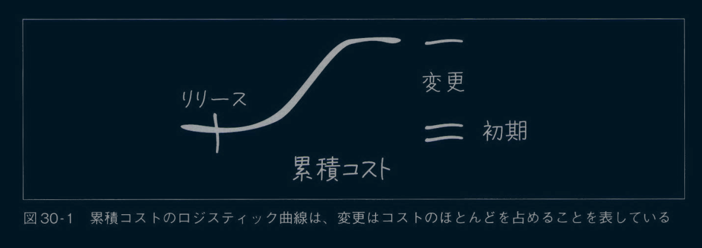

# 推薦のことば
ケント・ベックの話はいつ聞いても価値がある。私は本書のアドバイスを何十年も待ち望んでいた。本書は、ソフトウェア開発において、ツールや技術ではない本質的に重要なものに目を向けさせるのに役立つ。それが設計だ。設計とは私たちがコードを使って描こうとする形であり、ケントはうまく描く方法を教えてくれる。本書は、重要なテーマに関する重要な1冊だ。
**デイブ・ファーレイ** 、Continuous Delivery Ltd. 創業者兼デイレクター

理解しにくいコードベースでは、開発者はどこから手をつければよいかわからない。本書が提供するのは、どのレベルの開発者にとっても自分が取り組むコードの改善に役立つ実践的なアドバイスだ。
**サム・ニューマン** 、独立コンサルタント、テクノロジスト、『マイクロサービスアーキテクチャ』『モノリスからマイクロサービスヘ』著者

ケント・ベックが共有するたくさんの「とっつきやすい」アイデアは、複雑なコードを単純な形に変えるものだ。アイデア自体はシンプルだが、読んでみると、なぜ今まで考えもしなかったのかと思うものがほとんどだろう。クリーンで読みやすいコードにこだわるすべての人にお勧めする。
**ゲルゲイ・オロス** 、 The Pragmatic Engineer

何十年ものあいだ、リファクタリングに関する書籍が焦点を当ててきたのは、トップダウンのオブジェクト指向設計理論だった。本書はこの型を破り、実際のプロダクションコードを段階的に改善する現実的なアプローチを提供してくれる。
**モード・ルメール** 、『Refactoring at Scale』著者

正直に言おう。ソフトウェアエンジニアの仕事の99%は、既存プロジェクトに取り組むことだ。このような仕事は、コードが可読性を考慮して書かれていないととりわけ厳しいものになる。本書においてケント・ベックは、コードを通じて人間関係を優先することでその状況を好転させる。ソフトウェア設計を小さく段階的に改善する方法を端的に教えてくれるので、あなたにとっても同僚にとっても、コードはもっとクリーンになるだろう。
**ヴラッド・コノノフ** 、『ドメイン駆動設計をはじめよう』著者

卓越した才能と強い意志を持つギークであり、
多大な影響を与えてくれたバリー・ドゥヴォラツキー教授を追悼して

# まえがき

シリーズ最初を飾るこの薄い本は、プロのプログラマーのためのものである。プロのプログラマーとは、自分の技巧そのものや仕事を小さく改善して大きな成果を出すことに対して、ギークのように深くまで関心を持つソフトウェア開発者だ。著者のケント・ベックはまさにそのような熱心なプロフェッショナルであり、細部に注意を払いつつ大きな問題や全体像との調和も保っている。
現役のソフトウェア開発者は理論に注意を払わないことが多い。だがケントは理論と実践を組み合わせて、読みやすさと実用性を兼ねたコードヘの整頓を指南するとき、何を話すべきかよくわかつている。
理論上は、理論と実践に違いはないが、実際にはある。この合蓄のある発言にはさまざまなバージョンがあり、アルベルト・アインシュタインやヨギ・ベラなどに由来すると言われている。だが、これは間違いだ。言葉にうるさい人だけが気にするのだろうが(バレたか、私もだ)、正しくは1882年の「Yale Literary Magazine」に執筆したエール大学の学生であるベンジャミン・ブリュースターに由来する。QuoteInvestigator.comの言語ギークのおかげで、自信を持ってこのギーク独特の細部を伝えられる。この職業は、細部を正しく把握することにかかつているのだ。
理論と実践を結び付けるにあたって、ケントはごく小さなコード片とちょっとした細部に細心の注意を払うところから始め、それから、変更や修正が避けられない状況においても堅牢でクリーンなコードを作るプロセスを説明するという大きな視点へと進める。ケントは、最終的にソフトウェア開発の現実の経済性と、ソフトウェァェンジエアリングの中心的な理論を土台にして、この実践ガイドをまとめている。
中心的な理論はシンプルだ。コンピューターコードの複雑度は、どのようなパーツで構成されているか、それらが互いにどう結合しているか、パーッ自体がどれくらい凝集しているかによる、というものだ。結合と凝集の理論のもととなるのは、エドワード・ヨードンと私が書いた『Structured Design』(Yourdon Press,1975;Prentice Hall,1979、邦訳『ソフトウェアの構造化設計法』)にあるとされるが、さらにたどると、マサチューセッツ州ケンブリッジで1968年に開催されたカンファレンスでの発表に行き着く。結合と凝集は、1979年にPrentice Hallから出版したバージョンにはほとんど含まれていなかった。編集者は「誰も理論に興味がない」という理由で2つの章を外し、エドワードと私を納得させようとした。ソフトウェアエンジニアリングの歴史にとって幸運なことに、著者が勝利し、編集者が間違っていたことが証明された。その後、半世紀にわたる実践と文字どおり何百もの調査によって、この理論は検証されている。
結合と凝集は、コンピューターコードの複雑度を表すシンプルな尺度だ。これは、コンピューターのプログラム実行の観点ではなく、コードを理解しようとする人間の観点のものである。プログラムを理解するには、コードを作成するにしても、修正するにしても、変更するにしても、日の前にあるコードの一部分だけでなく、そのコードがつながっている他の部分、依存している部分、影響する部分、影響を受ける部分を理解する必要がある。コードがすべてまとまっていて、全体として理にかなったものになっていて、認知心理学者がゲシュタルトと呼ぶものを形成していれば、簡単に理解できる。それが凝集である。他のコードとの関係性の観点だと、関係性がないか、比較的弱いか、厳しく制限されていれば、これもまた簡単に理解できる。それが結合である。結合と凝集とは、脳が複雑なシステムをどう扱うかについての話なのだ。
ほら、素晴らしく整頓されているだろう。それが理論だ。では、実践の一つひとつと、それを理解するのに必要な理論へと進もう。ケント・ベックがあなたを案内してくれる。
2023年10月9日
マサチューセッツ州ローリーにて
**ラリー・コンスタンチン** 

ラリー・コンスタンチン(Larry Constantine)ポルトガルのマデイラ大学とオーストラリアのシドニーエ科大学の元教授。200以上の論文と36冊の著作があり、そのなかには、ルーシー・ロックウッドとの共著でジョルトアワードを受賞した『Software for Use』(Addison Wesley,1999、邦訳『使いやすいソフトウエア』共立出版)も含まれる。またりリオル・サムソンのペンネームで15冊の小説も執筆した。

# はじめに

## 本書について
「このコードを変更する必要があるが、めちゃくちゃだ。まず何をしたらいい?」
「変更を入れる前に整頓すべきだろうな。たぶん。いや、そうでもないか?」
あなたもそんな疑間を持ったことがあるだろう。もし簡単な答えがあるなら、私が「本を書いて言及しなければ」という気持ちにはならなかったと思う。
本書には以下のことを書いている。

- 処理を変更する前に、乱雑なコードをいつ整頓すべきか
- 乱雑なコードを安全かつ効果的に整頓する方法
- 乱雑なコードの整頓のやめどき
- 整頓がうまくいく仕組み

ソフトウェア設計は人間関係のエクササイズだ。本書は、鏡に映った自分、つまリプログラマーであるあなた自身との関係から始める。なぜ私たちは自分自身を世話するために時間を取らないのか?仕事を楽にするために時間を取らないのか? なぜ私たちはユーザーのための仕事を無視してまでコード掃除に没頭してしまうのか?
本書はギークが世界で安全に感じることを助けるという私の使命における次の一歩だ。乱雑なコードに直面したときに必ず行う初めの一歩でもある。ソフトウェア設計は、うまく使えば、この世界の痛みを和らげるパワフルな道具だ。下手に使うとただの抑圧の道具になり、ソフトウェア開発の効果を損なう。
本書はソフトウェア設計に焦点を当てた本のシリーズ最初の1冊だ。ソフトウェア設計を身近で価値あるものにしたいので、1人でできる種類のソフトウェア設計から始める。続刊では、チームのプログラマー同士の関係を癒し、もっと大きな問題に言及する。つまリビジネスとテクノロジーの関係だ。しかしまずは、ソフトウェア設計を理解して実践し、私たちの日常の仕事に利益をもたらそう。
たとえばコード行数の多い、大きな関数があるとする。それを変更する前には、何が行われているのかを知るためにコードを読まなければいけない。その過程で、論理的にコードを小さなチャンクに分割する方法がわかる。そのチャンクを抽出するとき、あなたは整頓しているのだ。整頓にはガード節や説明コメントやヘルパー関数を使うことも含まれる。
本書は、まさに本書のタイトル(*1)が表すことを実践している。つまり、小さなチャンクで **整頓** してみせながら、それをいつどこで適用できるかを提案する。そうすることで、あなたは整頓のやり方を一気に習得するのではなく、少しずつ整頓を試しながら自分の課題解決につなげていけるようになっている。本書はソフトウェア設計の背後にある理論、つまり結合、凝集、ディスカウントキャッシュフロー、オプショナリティについても説明する。
*1 訳注:本書のタイトル『Tidy First?』のtidyとは「〈…を〉きちんとする、片づける、整頓(せいとん)する」(研究社新英和中辞典)という意味である。

## 対象読者

本書が対象とするのは、プログラマー、リード開発者、現場に出るソフトウェアアーキテクト、技術マネージャーである。プログラミング言語によらず、開発者全員が自分のプロジェクトに本書の概念を当てはめながら読むことができる。本書は一般的なプログラミングの経験がそこそこあることを前提とする。

## 学べること

本書を読み終えるころには以下のことが理解できているだろう。
- システムの振る舞いに対する変更と構造に対する変更の基本的な違い。
- 1人のプログラマーがコードの変更を行うときに、構造への投資と振る舞いへの投資を交互に行うことを可能にする魔法。
- ソフトウェア設計がなぜ機能するのかについての基本理論と、設計に影響を与えるフォースについての基礎知識。

そして以下のことができるようになっているはずだ。

- ときには先に整頓(またあるときはあとに整頓)することによって自身のプログラミングの経験を改善すること。
- 大きな変更を小さく安全な手順で始めること。
- さまざまな動機を持った人たちが関わる活動であることを意識して設計に備えること。

## 本書の構造

本書はイントロダクションと3つの部分に分かれている。

- イントロダクション
    - 本書の執筆のモチベーション、執筆に至った経緯、誰に向けたものなのか、そして本書に何を期待できるかを簡単に説明するところから始める。それからすぐに本題に入る。
- 第1部 整頓
  - 整頓は赤ちゃんのよちよち歩きのようなミニリファクタリングだ。それぞれの短い章が1つの整頓になっている。該当するようなコードを見たら説明しているように変える。それから本番環境に投入する。
- 第2部 管理術
  - 次に整頓プロセスの管理を扱う。整頓の哲学の一部は、絶対に大ごとにしてはいけないということだ。報告や追跡をしたり、計画やスケジュールを立てたりすることは絶対にない。このコードの変更が必要だが、乱雑で変更が難しい。だから、先に整頓する。日々の仕事の一部であっても、これは思考によって改善できるプロセスだ。
- 第3部 理論
  - ここに至ってついに私はのびのびと羽を広げ、自分の心躍るトビックを深掘りしていく。「ソフトウェア設計は人間関係のエクササイズだ」とはどういう意味か?その人間とは誰なのか?どれほど良いソフトウェア設計ならその人のニーズを満たせるか?なぜソフトウェアのコストはこんなにも高価なのか?どうすればよいのか(ネタバレ注意:ソフトウェア設計)? 結合? 凝集? べき乗則?

私の目標は、読者が午前中に本書を読み始めたら、午後には設計が上達していることだ。そして日々少しずつ設計を良くしていく。そのうち、ソフトウェア設計は、ソフトウェアにおける価値提供の連鎖の弱点ではなくなるだろう。

## なぜ「経験主義的」ソフトウェア設計なのか?

ソフトウェア設計では何を設計するかについて大きく議論されているようだ。

- サービスの大きさはどのくらいがよいか?
- リポジトリの大きさはどのくらいがよいか?
- イベント vs 明示的なサービス呼び出し
- オブジェクト vs 関数 vs 命令形コード

**何** についての議論は、ソフトウェア設計者たちのもっと根本的な意見の違いを隠している。 **いつ** か、ということだ。この意見の違いの両端を風刺的に表現してみよう。

- 推測的設計
  - 次にやりたいことがわかっている。だから今日設計してしまおう。今すぐ設計するほうが安上がりだろう。ましてや、ソフトウェアが一度本番環境に入れば設計を変更する機会はない。だから今日すべてを詰め込んでしまおう。
- 反応的設計
  - 機能こそすべてだ。だから今日できる最低限の設計をして、機能の開発に戻ろう。追加する機能がほぼないという状態になったときだけ、仕方なく設計をする。しかも機能に戻るためにちょうど十分なだけの設計だ。

「いつ?」という質問には「中間のどこか」と答えることを目指している。ある機能のクラスを追加するのが難しくなると気づけば、私たちはプレッシャーが和らぐまで設計する。フィードバックサイクルを開始するのに十分な程度の設計から始める。

- 機能
  - ユーザーが欲しいものは何か?
- 設計
  - その機能を提供するためにプログラマーはどんなサポートができるか?

経験主義的ソフトウェア設計における「いつ?」という質問への答えは時と場合による。設計は、ニーズに合わせて適切なタイミングで行おう。この質問に答えるには、センスや交渉や判断力が必要になる。センスや判断力を必要とするのは弱点だろうか? もちろんそうだが、避けられない弱点だ。推測的設計も反応的設計も判断がつきものだが、ソフトウェア設計者に与えられる道具は少ない。
私は **経験主義的** という言葉を使ってこのスタイルを説明するのが好きだ。推測的設計や反応的設計のタイミングの違いを明確にしているように見えるからだ。「理論や純粋な論理よりも、観察や経験にもとづいていて、観察や経験と関連があり、観察や経験によって証明ができる」のだ。まさに適切だ。

## 本書の執筆に至った経緯

私は大学生のときにソフトウェア設計の授業を履修しており、その授業ではエドワード・ヨードン(故人)とラリー・コンスタンチンが書いた『Structured Design』(邦訳『ソフトウェアの構造化設計法』)を使っていた。本の内容はよくわからなかったが、それは、本が扱う問題に自分自身が直面した経験がないからだった。
それから25年、2005年のことだ。その時点で私はかなりの量のソフトウェア設計を経験していた。設計についてかなり正しい理解を持っていると感じていた。その本の出版30周年を記念して、00PSLA(オブジェクト指向プログラミングの大規模カンファレンス)ではステファン・フレイザーによるパネルセッションが企画された。エドワードとラリーは、レベッカ・ワーフす・ブロック、グレイディ、ブーチ、スティーブ・マコネル、ブライアン・ヘンダーソン・セラーズとともに登壇する予定だった。
舞台から吹き飛ばされたくなければ、ちょっとした予習が必要だった。そこで私は黄ばんだ『Structured Design』を引っ張り出し、読み始めた。数時間経って顔を上げた私は、すっかり心を奪われていた。ニュートンの運動法則だ。ただしソフトゥェア設計のための法則だ。出版されたときに、すべてが完全に明白になっていたのだ。その明白さを私たち業界全体はなぜ忘れてしまったのか。
パネルセッションがおもしろかったのは覚えている。カンファレンスのいちばんの思い出は、エドワードとラリーとともに朝食をとったことだ。極めて聡明な2人が完全に意気投合していた。図1は昔の教科書に書いてもらった2人のサインだ。

の献辞")

当時でさえその本は時代を感じさせた。紙テープや磁気テープの例はもはや現実味がなかった。アセンブリ言語対新しい高級言語のような議論も同じだ。それでも基本は完全に正しかった。私は今の時代の読者にこの素材を届けることを心に誓ったのだった。
その後数年かけて何度かソフトウェア設計の本を書こうとしたが失敗に終わった(「Kent Beck Responsive Design」で検索すれば、私が何をしようとしていたかわかると思う)。2019年に、たまたま何も予定のない2週間ができた。その2週間でどれだけ書けるか試すことにした。

図1 エドワード・ヨードン(「本に書いてあることは信じるな!」)とラリー・コンスタンチン(「上記を含む!」)の献辞

1万ワードほど書いてみると、重要なことがわかった。1冊ですべてのソフトウェア設計を扱うことは不可能だ。企画段階で何度も浮かんでいたシナリオが、小規模設計の機会だった。乱雑なコードがあったときに、変更するか、先に整頓するかだ。
私の執筆はいつもこんな感じだ。1冊の本にするには小さすぎる話題を選ぶ。書く。1冊の本にするには話題が大きすぎることがわかる。小さすぎるくらいの一部を取り出す。書く。一部が大きすぎることがわかる。繰り返す。
そういうわけで、こうしてほぼ20年前に立てた誓いが結実した本を(バーチャルまたはリアルで)あなたは手にしている。頻繁に「先に整頓すべきか?」という質問に答えることで、私が設計者として大切にしている多くの話題を扱えるようになった。あなたのフィードバックを楽しみにしているし、ソフトウェア設計を楽しく価値あるものにするすべてのものに対する理解がこれからも深まっていくことを楽しみにしている。

## オライリー学習プラットフォーム

オライリーはフォーチュン100のうち60社以上から信頼されている。オライリー学習プラットフォームには、6万冊以上の書籍と3万時間以上の動画が用意されている。さらに、業界エキスパートによるライブイベント、インタラクティブなシナリオとサンドボックスを使った実践的な学習、公式認定試験対策資料など、多様なコンテンツを提供している。

https://www.oreilly.co.jp/online-learning/

また以下のページでは、オライリー学習プラットフォームに関するよくある質問とその回答を紹介している。

https://www.oreilly.co.jp/online-learning/learning-platform-faq.html

## お問い含わせ

本書に関する意見、質問などは、オライリー・ジャパンまでお寄せいただきたい。

- 株式会社オライリー・ジャパン
- 電子メール japan@oreilly.co.jp

本書のWebページには、正誤表やコード例などの追加情報が掲載されている。

原書 : https://www.oreilly.com/library/view/tidy-first/9781098151232/
和書 : https://www.oreilly.co.jp/books/9784814400911/

オライリーに関するその他の情報については、次のオライリーのWebサイトを参照いただきたい。

https://www.oreilly.co.jp
https://www.oreilly.com

## 謝辞
「著者」というものは、複数の人間の集合体のようなものである。文字をタイプしたのは私だが、多くの人の助けがなければ、 **その** 言葉はあなたの手元に届くことはなかっただろう。ここに挙げるのはごく一部の人たちだ。
初期のフィードバックをくれたアンナ・グッドマン、マタン・ズルヤ、ジェフ・カーボネラ、デビッド・ヘイリー、ケリー・サットン、そしてGustoでの私の教え子たちに感謝する。手書き原稿に対する技術フィードバックをくれたモード・ルメール、レベッカ。ワーフス・プロック、ヴラッド・コノノフ、オレクシー・トルノフに感謝する。https://tidyfirst.substack.com の購読会員にも感謝したい。章の下書きごとにフィードバックをくれ、執筆の完成まで付き合ってくれた。
オライリーの専門的な制作チームに感謝する。メリッサ・ダフィールド、ミシェル・クローニン、ルイーズ・ケリガンのおかげでプロセスは最高にスムーズだった。短い本を書く機会をくれたティム・オライリーに感謝する。
キース・アダムスとパメラ・ヴァガダには、技術的な会話、励まし、たまに飲みに行ってくれたことに感謝する。ほどよい割合で励ましと促しをくれたスーザンに感謝する。私の子供たち、ベス、リンカーン、リンジー、フォレスト、ジョエルに感謝する。
ソフトウェア設計についてのメンターであり同僚であるウォード・カニンガム、マーチン・ファウラー、ロン・ジェフリーズ、エリック・ガンマ、デビット・スタッフ、マッシーモ・アーノルディに感謝する。
最後に、故エドワード・ヨードンとラリー・コンスタンチンに感謝する。何卜年も前にすべてを解き明かしてくれてありがとう。

# 目次
- 推薦のことば
- まえがき
- はじめに
- イントロダクション

- 第1部 整頓
  - 1章 ガード節
  - 2章 デッドコード
  - 3章 シンメトリーを揃える
  - 4章 新しいインターフェイス、古い実装
  - 5章 読む順番
  - 6章 凝集の順番
  - 7章 変数宣言と初期化を一緒の場所に移動する
  - 8章 説明変数
  - 9章 説明定数
  - 10章 明示的なパラメーター
  - 11章 ステートメントを小分けにする
  - 12章 ヘルパーを抽出する
  - 13章 ひとかたまり
  - 14章 説明コメント
  - 15章 冗長なコメントを削除する
- 第2部 管理術
  - 16章 分けて整頓する
  - 17章 連鎖
  - 18章 バッチサイズ
  - 19章 リズム
  - 20章 絡まりを解きほぐす
  - 21章 先に整頓、あとに整頓、改めて整頓、整頓しない
- 第3部 理論
  - 22章 要素を役立つように関係づける
  - 23章 構造と振る舞い
  - 24章 経済性:時間価値とオプショナリティ
  - 25章 明日の1ドルより今日の1ドル
  - 26章 オプション
  - 27章 オプション vs キャッシュフロー
  - 28章 可逆的な構造変更
  - 29章 結合
  - 30章 コンスタンチンの等価性
  - 31章 結合 vs 分離
  - 32章 凝集
  - 33章 結論
- 付録A 読書リスト・参考文献
- 訳者あとがき
- 索引

# イントロダクション

ソフトウェア設計は鋭利な道具だ。その道具を持っていることを知らない人もいれば、柄ではなく刃の部分を握る人もいる。だから私はソフトウェア設計について書くのだ。これは「ギークが世界で安全に感じることを助ける」という私の使命に帰結する。
この使命には2つの側面がある。ギークは安全でない方法でソフトウェアを設計することがある。システムの振る舞いを誤って壊したり、ソフトウェアを支える人たちの人間関係を壊したりするような方法だ。安全でない行動をしているときに不安を感じるのは当然だ。安全でない行動をしているときに不安を感じるほうが、のんきに何も知らず安全だと感じるよりはるかにマシだ。
あなたに安全に設計する方法を学んでもらえるなら、私の使命は達成に近づく。したがって、あなたは本書を通じて、少しずつ安全に仕事を進めるさまを何度も日にすることになるだろう。私は短期的な加速には興味がない。ソフトウェア設計の価値は、ソフトウェア設計が価値を生み出したときに生まれる。時間と共にわかってくるものなのだ。
先に整頓するのはちょっとした例外だ。先に整頓すると、整頓による価値はすぐにわかるだろう。これは準備だ。コードの振る舞いに手を加えるのと同じように、コードの構造に手を加えることにも慣れてほしいのだ。設計について詳しくなるにつれて、長期的な見返りがある行動、より多くの人に影響を及ぼす行動について話すようになるだろう。
ソフトウェア設計に関する他の記述を読んで、それらには重要な要素である「どれくらい?」と「いつ?」が抜けていることに気づいた。他のソフトウェア設計者は、まるで時間の制約が何もないところで設計しているかのごとく振る舞っているように見えた。すなわち、歩みを遅くする厄介なコードができる前に設計するか、コードの振る舞いを変更しなければいけないという継続的なプレッシャーから無限にタイムアウトして設計するかのようだったのだ。私は「どれくらい?」と「いつ?」という質問を深掘りし、私の提供する原則がその答えにつながるか確かめてみたくなった。
ソフトウェア設計はいつも私に知的なパズルを提供してきた。「この大きな変更を一ロサイズに縮められる設計があるとしたら、それはどんな設計なのだろうか」と考える瞬間が楽しい。私にとって、プログラミングはサディズムの香りがするのだ。複雑さという薪で燃やされる英雄的な自己犠牲だ。世界には困難があふれている。私たち自身や他の人たちが物事を簡単にできる機会を無視する余裕はない。
ソフトウェア設計のパズルのもう1つの側面は、どんなフォースが設計をあと押しするのか、そのフォースに対処するにはどの原則を使うかを理解することだ。多くの設計のアドバイスは、手に入るエビデンスとはっきりと矛盾している。なぜ熟練の設計者が、彼らが支持する原則から導かれるはずのない結果を生み出すのだろうか? 本当は何が起こっているのだろうか?
本には隠れる場所がない。私があるトピックを完全には理解していなければ、あなたにわかってしまうし、それに対して私ができることは何もない。凝集がその一例だ。15年前にはっきりと定義できた概念だが、昨年まで満足な説明ができなかった。なんとしても理解したいと思っている。
雪崩が起きれば最高だ。先に整頓するのを実践しているうちに到達してほしい瞬間がある。この部分を整頓すると、この機能が簡単になる。あの部分を整頓すると、あの機能が簡単になる。そうして、整頓の効果が積み上がっていく。この部分を簡単にしたからこそ、あの部分が簡単になったのだ。突然、多くの労力をかけてもいないのに、巨大な単純化がまるでペンを1～2回動かすようなものになる。すべてのステップを同僚と一緒に進めてきたので、あなたの精神を完全に理解している支持者がいる。小さく小さく進めた結果たどりついた大きな構造変更の恩恵を受けるにつれて、支持者は感謝するようになる。
本書執筆のモチベーションの最後の1つはお金だ。他でも書いたように、私が執筆するのはお金を稼ぐためではない。執筆できる程度にお金が稼げればそれで十分だ。すべての技術書と同じく、こういった本が大当たりの大金を生むことは期待していない。だが、大金というのが良い車を買えるくらいという意味なら、絵を描いたり、ギターを弾いたり、ポーカーをしたりする代わりに執筆するモチベーションとしては十分だ。そう、そのために多少のお金は稼ぎたいのだが、本書の価格よりはるかに多くの価値を提供するつもりだ。

# 第1部 整頓

具体から抽象に向かうのが、ふだん私が学習する際の戦略だ。それゆえ、乱雑なコードを変更する必要性に直面したときに設計上で打てる「一手」にはどんなものがあるのか、一覧するところから始めよう。
リファクタリングをよく知る人なら、「振る舞いを変更することなく構造を変更する」として定義されるリファクタリングと、整頓の類似性の高さに気づくだろう。整頓はリファクタリングのサブセットだ。整頓は可愛くてふわふわした小さなリファクタリングなので、誰も嫌いになれないはずだ。
「リファクタリング」という言葉は、機能開発の長い中断を指す言葉として使われ始めたときに致命傷を負った。「振る舞いを変更することなく」という条項さえもなきものにされ、「リファクタリング」は簡単にシステムを破壊できるようになった。新機能なし、損害の可能性あり、最終的に見せるものもなし、だって? もう結構だ。
第2部では、整頓を開発のワークフローに統合する方法を見ていくが、さしあたって第1部では、これらの小技を読み、学び、適用して、明日の開発を楽しくしよう。

## 1章 ガード節

次のようなコードがある。

```python
if(条件)
    …何らかのコード…
```

もしくは、こっちのほうがよいかもしれない。

```python
if(条件)
    if(not 他の条件)
        …何らかのコード…
```

読み手はネストした条件で迷子になりがちだ。次のように整頓しよう。

```python
if(not 条件)return
if(他の条件)return
…何らかのコード…
```

このほうが読みやすい。「コードの細部に立ち入る前に、念頭に置くべき事前条件がある」と言っているのだ。
だが、複数のreturnについてはどうだろうか? ルーチンの戻り値を1つにするという「ルール」は、FORTRANの時代に由来する。FORTRANでは、1つのルーチンが複数のエントリーポイント **と** イグジットポイントを持つことができた。でも、そんなコードをデバッグするのはほぼ不可能だ。どのステートメントが実行されたかもわからない。ガード節があるコードは、事前条件が明白なので分析しやすいのだ。
ガード節は使いすぎないこと。1つのルーチンに7つも8つもガード節があるコードは読みにくい(実際に遭遇したことがある)。
その場合は、複雑さを分割するのに細心の注意が必要になる。
整頓後も同じように条件を正しく満たせる場合だけ、ガード節に整頓しよう。

```python
if(条件)
    …ルーチンの残りのすべてのコード…
```

以下のようなコードは整頓したくてもできない。

```python
if(条件)
    …何らかのコード…
…さらに別のコード…
```

たぶん最初の2行はヘルパーメソッドとして抽出できる。 **そのあとなら** ガード節を整頓できる。だが、 **常に** 小さなステップ **だけ** で進めよう。
例として、https://github.com/Bogdanp/dramatiq/pull/470 を参照してほしい。

## 2章 デッドコード

消そう。以上。実行されないコードは消すだけだ。
デッドコードを消すことに強い抵抗を感じる人もいるだろう。誰かが時間と労力をかけて書き、それに対して組織がお金を払った。そんなコードが残っているのだ。無駄金にしないためには、またコードが呼び出されるようにすればよいだけだ。それに、消したコードが将来必要になったら、消したことを後悔するかもしれない。
このなかにどれだけの認知バイアスがあるか探してみてほしい。整頓好きなあなたへのエクササイズだ。
デッドコードを特定するのは簡単だ。だが、リフレクションが多用されているようなときには少し難しい。コードが使われていなさそうだと当たりをつけたら、整頓する前に使用状況のログを取ってみよう。本番環境に載せて、確信が持てるまで待つのだ。
「でも、もしあとで必要になったら?」と考えるだろう。そのためのバージョン管理なのだ。実際には何も削除していない。今は見る必要がないというだけだ。コードがもし(これは条件式の長い羅列だ)、1)たくさんある、かつ、2)今は使われていない、かつ、3)将来使いたい、かつ、4)書いた当初と同じ使い方をする、かつ、5)今も動作する、ならば、元に戻せる。そうでなければ、書き直したほうが良いものになる。しかし、最悪なことになったとしても、いつでも元に戻せる。
いつものように、少しずつコードを削除しながら整頓しよう。そうすれば、間違いに気づいても、比較的簡単に変更を元に戻せるだろう(28章参照)。「少しずつ」の尺度は認知的なものであって、コード行数ではない。条件式(たとえば真になることがわかっている場合)の節かもしれないし、ルーチン、ファイル、ディレクトリかもしれない。

## 3章 シンメトリーを揃える

コードは有機的に成長する。「有機的」という言葉を軽蔑の意味で使う人もいるが、私にはわからない。将来必要となるすべてのコードを一度に書くことはできない。それができるのは、私たちが何も学ばなかったときだけだ。
有機的に成長するなかで、同じ問題であっても、取り組む時期や人が違えば別の形で解決されることがある。それは構わないが、読むのが難しくなる。読み手としては、一貫性が欲しい。パターンが見つかれば、起きていることを理解しながら、安心して結論までジャンプできる。
変数の遅延初期化の例を見てみよう。違う方法で書いてあるのがわかる。

```python
foo()
    return foo if foo not nil
    foo := …
    return foo

foo()
    if foo is nil
    foo := …
    return foo

#トリッキー

foo()
    return foo not nil
    ? foo
    : foo := …

#代入が式であると仮定すると、二重でトリッキー
foo()
    return foo := foo not nil
    ? foo
    : …

#条件が隠されていて、もっとトリッキー
foo()
    return foo := foo || …
```

もっと別の形を発見、発明できるか考えてみよう。
どれも「まだ値が決まっていないfooの値を計算してキャッシュする」方法だ。どの方法にも善し悪しがある。読み手はどの方法でもすぐに慣れるだろう。混乱が起きるのは、2つ以上のパターンが同じように使われる場合だ。読み手は、違いは違いであることを期待する。違いは、同じことをしているという事実を覆い隠すのだ。
やり方を1つ選ぼう。他もそのやり方に合わせよう。不要なバリエーションを1つずつ整頓していこう。たとえば最初に遅延初期化に取り組んでみるのはどうだろう。
まれに、余計なものが共通点を隠してしまうことがある。似ているが同一ではないルーチンを探そう。同じ部分と違う部分を分離していこう。

## 4章 新しいインターフエイス、古い実装

あるルーチンを呼び出す必要がある。だが、インターフェイスのせいで、難しく、複雑で、混乱を招き、面倒なものになっている。そんなときは、自分が呼びたいと思うインターフェイスを実装して、それを呼ぼう。新しいインターフェイスは、単に古いインターフェイスを呼ぶ(すべての呼び出し元を移行できたら、そのあとで実装をインライン化できる)。
透過的なインターフェイスを作るのは、ソフトウェア設計における最小単位の本質だ。振る舞いをちょっと変更したいときに、変更が簡単になる。新しいインターフェイスを作る意義はそこにある。
同じ原貝Jが次の場合にも当てはまる。

- **後ろからコーデイングする** :必要な中間結果がすでにすべて揃っているかのように、ルーチンの最終行から始める。
- **テストファースト** でコーデイングする:成功しなければいけないテストから始める。
- **ヘルパー** を設計する:○○を行うルーチン、オブジェクト、サービスがあれば、残りは簡単になる。

## 5章 読む順番

想像してみてほしい。今あなたは何らかのファイルを読んでいる(ソースコードがファイルに属するかどうかは、また別の機会に議論しよう)。ファイルを最初から最後まで読んで、その最後にようやく欲しかった情報を見つける。先にこの情報があれば、残りの部分の理解に役立ったはずだ。
ファイル中のコードを読み手(それぞれの書き手にたくさんの読み手がいることを忘れないように)が遭遇したいと思う順番に並べ替えよう。
あなたは読み手だ。ただ読む。それで理解できるのだ。
同時に他の整頓をする誘惑に負けないこと。読んでいるうちに、理解や変更を必要以上に難しくしている点に気づくことがあるかもしれない。そこはあとで時間を取ろう。もしくは、今はそこを整頓して、あとで読む順番を入れ替えよう。混ぜてはいけない。
いくつかの言語では、要素の宣言順を慎重に扱う必要がある。つまり、関数Aと関数Bの順番を入れ替えると、違う実行結果になることがある。そのような言語では注意が必要だ。ファイル全体の順番を入れ替えるのではなく、読み手にとっていちばん関係のある部分だけを整頓するほうがよいかもしれない。
要素の並び順に完璧なものはない。最初に基本的な部分を理解してから、それがどう組み合わされるのかを理解したいときもある。最初にAPIを理解してから、実装の細部を理解したいときもある。あなたは読み手なのだから、自分の判断と(直近の)経験を活かしてはしい。あなたならどのような順番で遭遇したかっただろうか? その順番を次の読み手に贈るのだ。

## 6章 凝集の順番

コードを読む。振る舞いに変更を加えるためには、コード中にばら撒かれた箇所に変更を加えなければいけないことがわかる。そして、イライラする。さて、どうすべきか?
コードの順番を入れ替えて、変更対象の要素が隣接するようにしよう。凝集の順番での並べ替えは1つのファイルに複数のルーチンがある場合に有効だ。結合しているルーチンは、隣り合わせにする。1つのディレクトリに複数ファイルがある場合にも有効だ。結合しているファイルは、同じディレクトリに置く。リポジトリをまたいでいる場合でさえ有効だ。結合しているコードは、変更を入れる前に同じリポジトリに置く。
ただ単に結合を取り除くだけにしてはどうか?や り方がわかっているのなら、やってみよう。以下が成り立つ場合は、整頓するのに最善の方法だ。

- cost(分離) + cost(変更) < cost(結合) + cost(変更)

だが、こんな場合には、実現不可能かもしれない。

- 分離が知識面で難しい(やり方がわからない)。
- 分離が時間的・金銭的に難しい(やれるだろうが、今すぐにはその時間が取れない)。
- 分離が関連性の面で難しい(チームは今はこれ以上の変化を受け入れられない)。

無理してスイスチーズの穴のように変更箇所を散らばらせておく必要はない。整頓によって凝集度を高めれは振る舞いの変更が簡単になる。凝集度を高めれば、分離の妨げとなっているものを取り除くこともできる。凝集度を高めることで、結合があっても平気でいられるようにもなるのだ。

## 7章 変数宣言と初期化を一緒の場所に移動する

変数とその初期化はときに離れてしまうことがある。変数の名前は、処理においてそれがどんな役割を持つかというヒントを与えてくれる。そして、初期化は名前が持つメッセージを強化する。宣言(と取りうる型)と初期化が離れているコードだと、読みにくくなる。初期化にたどりつくころには、その変数が **何のため** のものかのコンテキストを忘れてしまうのだ。
どう整頓するか見ていこう。以下のようなコードを想像してはしい。

```go
fn()
    int a
    …aを使わない何らかのコード
    a = …
    int b
    …さらに別のコード。aは使っているがbは使っていない
    b = …a…
    …bを使っている何らかのコード
```

初期化を宣言のところに移動して、整頓しよう。

```go
fn()
    int a = …
    …aを使わない何らかのコード
    …さらに別のコード。aは使っているがbは使っていない
    int b = …a…
    …bを使っている何らかのコード
```

順番をいろいろ変えて試してみよう。変数をそれぞれ使う直前に宣言して初期化するのと、関数の先頭でまとめて宣言して初期化するのでは、どちらが読みやすくて理解しやすいだろうか? ここはあなたが推理小説家になるところだ。コードの読み手の体験を想像して、誰がそうしたのかを推測するのに必要な手がかりを残すのだ。
変数とそれを設定するコードを雑な順番に並べることはできない。変数間のデータの依存関係を考慮しなければいけないのだ。bを初期化するのにaが必要なら、まずはaを初期化しなければいけない。この整頓をする場合は、データの依存関係の順序を維持しなければいけないことを覚えておこう。
データの依存関係を手作業で分析しなければいけないのだとすると、最終的には間違えることになる。構造を改善しようとしただけなのに、間違ってコードの振る舞いを変更してしまうだろう。だが、問題ない。コードを正しいバージョンに戻せばよいだけだ。小さなステップで進めよう。これが整頓方法だ。大きな設計変更は大変で怖い?月ヽさなステップで進めよう。これ以上ないくらい小さくするのだ。まだ怖いだろうか? そんなことはない? 素晴らしい。

## 8章 説明変数

式は成長する。たとえ小さく始めても、成長する。成長して、成長し続ける。やがて、あなたは老眼鏡をかけながら近づいて、何が起きているのか理解しようとする。
そして、大きくてややこしい式の一部を理解したら、その部分を意図がわかる変数に抽出する。
これはグラフィクスを扱うコードでよく見るコードだ。

```go
return new Point(
    …大きな長い式…
    …他の大きな長い式…
)
```

どちらかの式を変更する前に、先に整頓することを考えよう。

```go
x := …大きな長い式…
y := …他の大きな長い式…
return new Point(x, y)
```

あるいは、その式は何かもっと具体的なことを意味しているかもしれない。たとえば、横幅と高さ、XY座標、X軸とY軸の変化量などだ。
この整頓ではあなたが苦労して勝ち取つた理解をコードに落とそう。こうして分離したことで、どちらの式もより簡単に変更できるようになったし、次にそのコードを変更するときにより早く読めるようにもなった。
いつものように、整頓のコミットと振る舞いを変更するコミットは分けよう。

## 9章 説明定数

さて、コードを読んでいると、理解できない数字を見ることがある。もしくは、コード中に繰り返し現れる文字列の固定値を見ることがある。その固定値が **何を表しているのか** を知ろうとする。
シンボリック定数を作ろう。リテラル定数を使うのをやめ、シンボリック定数で置き換えよう。
まあ、見てほしい。私がまだ駆け出しのプログラマーだったころからよく目にしたアドバイスだ。いまだにこんなコードが許されると思っている人も多いらしい。

```go
if response.code = 404
    …ほげほげ…
```

すまない。ちょっと嫌味ったらしかった。とっ散らかす人たち(ヒント:自分かも)を裁くことが目的ではないのだ。何かを変更する前に自らが先に整頓できる人間になることが目的なのだ。

```go
PAGE_NOT_FOUND := 404
if response.code = PAGE_NOT_FOUND
   …ほげほげ…
```

ここで注意してはしいことがある。同じリテラルが2箇所に現れ、別の意味を持つことがあるのだ。これでは整頓しても役に立たない。

```python
ONE=1
…ONE… # 1 が必要な箇所すべて
```

コードを読んでいく。理解する。その理解をコードに落とせば、頭の隅に置いておく必要がなくなる。
これに関連して、他にも整頓がある。まとめて理解あるいは変更する必要がある定数を1箇所に集めたり、何らかの理由でひとかたまりになっている定数を分離したりだ。それは自分で考えてほしい。結合、凝集、お好きにどうぞ。

## 10章 明示的なパラメーター

変更したいコードを読んでいて、コードが操作しているデータの一部がルーチンに明示的に渡されていないことに気づいたとしよう。どのように入力を明確にすればよいだろうか?
ルーチンを分割しよう。上部でパラメーターを集めて、次の部分に明示的にそれを渡すのだ。
パラメーターのかたまりをマップで渡すことがよくある。これだと、どんなデータが必要なのかを読み取って理解するのが難しくなる。あとで(暗黙的に)使うために、そのパラメーターを変更するという恐ろしい悪用にもつながる。
たとえば、こんなコードがあるとする。

```go
params={ a:1, b:2 }
foo(params)

function foo(params)
    …params.a…, …params.b…
```

fooを分割することで、パラメーターを明示的にする。

```go
function foo(params)
    foo_body(params.a, params.b)

function foo_body( a, b )
    …a…, …b…
```

明示的なパラメーターが必要な別の例として、コードの深いところで環境変数の利用を見つけた場合が挙げられる。パラメーターを明示的にしてから、それを呼び出し関数のチェーンの上位に持ってくるようにしよう。こうすれば、コードが読みやすくなり、テストや分析もしやすくなる。

## 11章 ステートメントを小分けにする

「整頓大賞シンプル部門」を受賞するのはこれだ。大きなコードのチャンクを読んでいると、「ああ、ここは **これ** をしていて、あそこで **あれ** をしているのか」とわかる。そのあいだに空行を入れよう。
この整頓は非常にシンプルなのがよい。これは **Tidy First?** の哲学の一部だ。ソフトウェア設計を大げさなものにしてはいけない。そこから逃げてしまいかねないからだ。ソフトウェア設計は変更を容易にする。少しのソフトウェア設計でも、変更を簡単にすることができる。
何がイケてるかと言えば、これは複利の原理だということだ。ソフトウェア設計はソフトウェア設計を簡単にする。これは良くも悪くもだ。設計に没頭するあまり、変更を入れることを忘れてしまうかもしれない。それではダメだ。うまくやれば、ソフトウェア設計は変更を容易にするソフトウェア設計を可能にする。
ステートメントを小分けにしたら、説明変数（8章）、ヘルパーを抽出する（12章）、説明コメント（14章）など、他にもいろいろすることがある。

## 12章 ヘルパーを抽出する
ルーチン内に、明確な目的を持ち、他のコードとの相互作用が限られているコードブロックがある。これをヘルパールーチンとして抽出しよう。(ルーチンがどのように機能するかではなく)目的に合わせてルーチンに名前をつけよう。
リファクタリングに詳しい人なら、この整頓を「メソッドの抽出」と考えるだろう。この整頓やリファクタリングを実行するには、自動リファクタリングがないと厄介だ。だから自動リファクタリングが実行できる環境にいるべきだ。なにしろ21世紀なのだ。
ヘルパー抽出の特別なケースをいくつか紹介しよう。1つは、大きなルーチン内の数行を変更する必要がある場合だ。その行をヘルパーとして抽出し、ヘルパー内の行だけを変更する。そして、それが理にかなっているなら、ヘルパーを呼び出し元のルーチンにインライン化する(たいていは、そのヘルパーに愛着が湧いて、そのまま使い続けることになる)。
たとえば、このようなコードがあるとする。

```python
routine()
    …変更しない部分…
    …変更する部分…
    …変更しない部分…
```

こうなる。

```python
helper()
    …変更する部分…
routine()
    …変更しない部分…
    helper()
    …変更しない部分…
```

(この先を読んでいれば、このような抽出は凝集、つまり、まとまりのある要素を作り出すことだとわかるだろう。まだ先を読んでいなくても心配ない。すぐにわかる)。
もう1つのヘルパー抽出のケースは、時間的な結合を表現する場合だ(a()はb()の前に呼び出される必要がある)。
たとえばこんなコードがある。

```python
foo.a()
foo.b()
```

よく、こうする。

```python
ab()
    a()
    b()
```

ヘルパーを使い続ける理由は何も愛着だけではない。新しいヘルパーを作ってから数時間後、あるいは数分後に使いたくなることがよくある。インターフェイスは問題を考える道具になる。新しいインターフェイスは、私たちがより抽象的に考え、デザインボキャブラリーに言葉を加える準備ができたときに現れる。
ヘルパーを適用できるすべての場所で使おうとする必要はない。ヘルパーの使用は別の整頓で対処できる(ツールによっては、新しいヘルパーの適用箇所を自動的に特定して変更してくれる。そのようなツールには天恵がある)。

## 13章 ひとかたまり

細かく分割されているがゆえに、かえって理解を妨げているようなコードに出会うことはないだろうか。必要な範囲でなるべく多くのコードをインライン化して、大きなひとかたまりにしよう。そこから整頓するのだ。
コードの最大のコストは、コードを書くことではない。コードを読んで理解することだ。先に整頓することで、たくさんの小さな部品に分けようとする方向に向かう。これは理論上は結合を減らして凝集を高め、実践的には同時に頭に入れておかなければいけないことを減らす。
小さな部品に分けようとするのは、コードを少しずつ理解できるようにしたいからだ。だが、ときには、このプロセスが間違った方向に進むことがある。小さな部品のやりとりの仕方によっては、コードが **理解しにくくなる** のだ。明確さを取り戻すには、まずはコードを1箇所に集めて、それから改めて、簡単に理解できる部品を抽出する。
探すべき兆候は次のようなものだ。

- 長くて、繰り返しの引数リスト。
- 繰り返しのコード。特に繰り返しの条件式。
- ヘルパールーチンのよくない名前付け。
- 共有の可変データ構造。

小さな部品に分けようとすることを踏まえると、ひとかたまりにして整頓するのは違和感がある。だが、妙に満足するのだ。私は、ずっとコードを部品単位で理解しようとしてきた。だが、私は自分の理解を疑い始めた。そこで、180度方向転換して、ひとまとめにし始めたのだ(自動リファクタリングでこれができれば役に立つが、必要なら手作業でもするつもりだ)。なんという安心感だろうか!
かたまりが大きくなるにつれて、頭のなかに形が浮かび上がってくる。なるほど……。まずこれを計算して、その結果を使ってあれを計算するんだ!どうしてただそう言わなかったのだろうか? そこでタイトルの質問にたどりつく。先に整頓すべきだろうか? それとも、今わかっている変更をするだけでよいだろうか?

## 14章 説明コメント
コードを読んでいて「なるほど、それで **こう** なっているのか」と声が出ることがある。これは貴重な瞬間だ。記録しよう。
コードからは読み取れないことを書いておく。未来の読み手や15分前の自分自身の立場に立ってみよう。何を知っておきたかっただろうか?「以下の処理が複雑なのは、ネットワーク呼び出しの回数をできる限り減らすためである」のようなメモかもしれない。
あなたとは違うタイプの人だとしても、特定の誰かに向けて書こう。自分がコンピューターサイエンティストのチームで唯一の生物学者だったら? それなら、自分にとっては明白なことでも、コードに生物学の文脈で説明を入れておくほうがよい。第三者の観点から考えて、ありがちな疑間に先回りして回答しておくことが重要だ。
ヘッダーコメントがないようなファイルに出くわしたら、将来の読み手に向けて、なぜこのファイルを読むことが役に立つのかを伝えるヘッダーを追加することを検討してほしい(アラン・メルトナーに感謝*1)。
*1 訳注:ケント・ベックの有料記事(https://tidyfirst.substack.com/p/reading-order)へのフィードバックコメント。
欠陥を見つけた直後はコメントをするのに絶好のタイミングだ。たとえば、
```c
// 別のケースを追加する場合は必ず../fooも変更すること
```
とかだ。こういった結合があるのは理想的ではない。いずれ結合のなくし方を学ぶ必要が出てくるが、それまでは、砂に埋めるよりも結合の問題を指摘するコメントを追加しておくほうがはるかにマシだ。

## 15章 冗長なコメントを削除する

コードに書いてあることをそのまま書いてあるコメントがあったら、消そう。コードの目的は、コンピューターに何をさせたいのかを他のプログラマーに説明することだ。コメントとコードは書き手のあなたにとっても、未来の読み手にとっても、違うトレードオフをもたらす。文章は何でも説明できる。一方で、システムの変更に伴って文章の正確さをダブルチェックする仕組みはないし、コードが進化するにつれてコメントが冗長になるかもしれない。
ある人は、コミュニケーションの義務について視野が狭く、あらゆるルーチンにはコメントがあるべきだ、というような独断的ルールを主張する。その結果、次のようなコメントが生まれる。

```go
getX()
    #Xを返す
    return x
```

このコメントはコストだけで何もメリットがない。書き手は、読み手の時間を無駄にしただけだ。その時間を取り戻すことはできない。完全に冗長なコメントは消そう。

整頓はよく連鎖する。以前の整頓によってコメントが冗長になることもある。たとえば、このようなコードがある。

```go
if(generator)
    …ジェネレーターをセットアップするコードのかたまり…
else
    #ジェネレーターがない場合、デフォルトを返す
    return getDefaultGenerator()
```

ガード節で整頓すると、次のようになる。

```go
if(!generator)
    #ジェネレーターがない場合、デフォルトを返す
    return getDefaultGenerator()
…ジェネレーターをセットアップするコードのかたまり…
```

最初のコードのコメントは冗長ではない。違うコンテキスト(ジェネレーターがあって、セットアップが必要)の山のようなコードを読んだあと、現在のコンテキスト(ジェネレーターがない)に注意を戻すものだ。しかし、整頓のあとでは、コメントはコードに書いてあることをただ言い直しているだけになってしまった。だから、消そう。アスタ・ラ・ビスタ、アディオス、あばよ。
整頓の連鎖については、第2部で詳しく話そう。

# 第2部 管理術

整頓はソフトウェア設計であり、あなた、あなたとコードの関係、そして最終的にはあなた自身との関係に向き合うものだ。シリーズの続刊では、テームがソフトウェア設計に一緒に取り組む理由と、そのやり方について扱う。さらにその次に、ソフトウェア設計と、プログラマーでない人との関係においてソフトウェア設計が果たす役割について説明するつもりだ。だが、まずはギークのセルフケアとしての整頓だ。
整頓の手順は練習すれば自然と身に付く。ほとんどの場合、自動化によるサポートは必要ない。リファクタリングが実現可能になってから何十年も経った今でも、プログラミングの環境はどうにも自動化によるサポートを欠いている。だが、大文夫だ。ソフトウェアを少しずつ、いつも設計することに慣れてほしい。整頓はリファクタリングヘの入り口なのだ。
整頓を適用できるようになっただけでは、整頓をマスターしたことにはならない。本書のタイトルは、疑問符を強調した「Tidy First?」である。整頓ができるからといって整頓すべきとは限らないことを伝えたかったのだ。
整頓管理術に関する本章では、個人の開発ワークフローに整頓を組み込む方法について説明する。
- いつ整頓を始めるか?
- いつ整頓をやめるか?
- どのように整頓、すなわちコードの構造の変更と、振る舞いの変更を組み合わせるのか?

まず、整頓がプルリクエストやコードレビューにどのように相互作用するのか議論することからはじめよう。

## 16章 分けて整頓する

今のところはプルリクエスト/コードレビューのモデルを使うと想定する(のちほど代替案について議論する)。整頓をどこに入れればよいだろうか?
以下は堂々巡りのひどい例だ。

1. 整頓を振る舞いの変更と一緒に入れる。
2. レビュアーはプルリクエストが長すぎると文句を言う。
3. 整頓を独立したプルリクエストに分けて、振る舞いを変更する前にプルリクエストを出す(たぶんこちらだろう)、もしくは振る舞い変更のあとに回す。
4. レビュアーは整頓のプルリクエストが無意味だと文句を言う。
5. 1に戻る。

整頓はどこかに入れなければいけない。さもないと整頓しない。ではどこに入れればよいだろうか?結論。整頓はそれ用のプルリクエストに入れる。整頓はプルリクエストごとにできるだけ少数にする。
もう少し詳しくトレードオフを見ていこう。整頓を学んでいる人たちには、同じような傾向が見られる。最初はただ変更するだけで、何も区別していない大量の変更から始める(図16-1)。


ここで、ifステートメントを修正している途中で名前が間違っていることに気づき、それを直してからifステートメントに戻る。変更は変更だ。
整頓を学んだあとは、まるで顕微鏡のビントが合ったときのようになる。変更のいくつかはプログラムの振る舞いと属性に関するもので、プログラムを動かすとわかるものだ。だが、変更のなかには、プログラムの構造を変更しているものもある。このような変更はコードを見ないとわからない。図16-2で、Bは振る舞い(Behavior)、Sは構造(Structure)を示す。


この時点では計画もなければ、振る舞いや構造の変更の流れもない。種類が違う2つのものが一緒になっていることだけは気づいている。
そうこうしているうちに、いつもの流れに気づき始める。ステートメントを小分けにすると説明ヘルパーができ、振る舞いの変更が簡単になる。そうなればプログラミングはチェスのようなものだ。ゲームが数手先までどんな順番で進むかを想像できるようになる(図16-3)。


この時点ではまだ1つの大きなプルリクエストになっている。ループのステップ1にいるのだ。私たちの動きはすべて意図的であり、簡単な変更をするか、変更を簡単にするかのいずれかを狙ったものだ。だが、まとめてしまうと少し混乱する。レビュアーは尻込みするだろう。
そこで、変更を複数のプルリクエストに分ける。複数の整頓を1つのプルリクエストにする(整頓が1つしかないときも同じだ)。振る舞いの変更も別のプルリクエストに分ける。整頓と振る舞いの変更を切り替えるたびに、新しいプルリクエストを作るのだ(図16‐4)。


プルリクエストをまとめたり分けたりするのにはトレードオフがある。インセンティブの観点から考えよう。全部入りの巨大なプルリクエストだと全体像はわかりやすいが、レビュアーが役に立つフィードバックを提供するには大きすぎる。小さいプルリクエストは細かいフィードバックを促すが、枝葉末節にとらわれてしまうリスクもある。
レビューのレイテンシーもインセンティブになる。コードがすばやくレビューされるなら、小さなプルリクエストをたくさん作る力が働く。焦点を絞ったプルリクエストであれば、レビューも速くなる。この強化ループは逆方向にも同じように作用する。遅いレビューが大きなプルリクエストを促し、そのあとのレビューがさらに遅れる。
整頓に慣れ、小さなステップで作業することに慣れ、安全に作業することに慣れたら、整頓のプルリクエストではレビューを必須にしない実験をしてみよう。こうすればレイテンシーは減り、さらに小さい整頓のプルリクエストを作るインセンティブになる。

## 17章 連鎖

整頓はポテトチップスのようなものだ。1つ食べれば、もう1つ食べたくなる。整頓をしたい衝動を抑えることが、整頓スキルのカギとなる。整頓し終わった。もっと整頓すべきか?それは時と場合による(詳しくは第3部で見ていく)。
どのような大きさでステップを踏むかはあなた次第だが、小さな整頓のステップにこだわって実験することをお勧めする。各ステップを最適化するのだ。外から見れば走っているように見えるが、ムカデのように小さなステップをたくさん踏んでいることがわかるはずだ。
整頓で先の展開が見えるようになっていく。さながらチェスだ。どのように整頓が先の整頓を生み出すのか見てみよう。

- ガード節
  - ガード節を設定したら、その条件を説明ヘルパーに置き換えたり、説明変数に抽出したりするとよい。
- デッドコード
  - 散らかったデッドコードを取り除いたら、読む順番や凝集の順番への並べ替えの方法が見えてくるかもしれない。
- シンメトリーを揃える
  - 同じことをしているコードは同じように、違うことをしているコードは違って見えるようにすると、関連するコードをきちんと読む順番にまとめられるだろう。以前、複数のウェブのエントリーポイントを含んだファイルでこれをしたことがある。それらが同じように見えるようになったら、残りのコードヘの目次のようなものとして、自然とファイルの先頭でグループ化していた。
- 新しいインターフェイス、古い実装
    - ピカピカの新しいインターフェイスを手に入れたら、使いたくなるだろう。呼び出し元を自動で書き換えるツールがなければ、一度に1つずつ変換しなければいけない。これが、初めてファンアウトに遭遇する瞬間だ。ファンアウトとはつまり、整頓がさらに多くの整頓を誘発し、それらの整頓がさらに多くの整頓を誘発する現象だ(これについては、結合とべき乗則について話すときに詳しく説明する)。
- 読む順番
  - 読む順番が確立できたら、シンメトリーを揃える方法が見えてくるかもしれない。以前は、要素が離れすぎて共通点が見えなかった。
- 凝集の順番
  - 凝集の順番にグループ化された要素は、子要素に抽出する候補となる。たとえば、ヘルパーオブジェクトは整頓の対象外だ。ただし、整頓に慣れて自信がついてきたら、さらなる振る舞いの変更を簡単にする、より大きな規模の設計変更がおのずと見えてくる。
- 説明変数
  - 説明変数への代入の右側は、説明ヘルパーの候補だ(このあと、変数をインライン化できるかもしれない)。変数名による説明で冗長なコメントを消せるかもしれない。
- 説明定数
  - 説明定数を抽出することは凝集の順番につながる。同期して変更する定数をグループ化することは将来の変更を簡単にする。定数をどこに置くか、どう並べ替えるかにはさまざまな考え方がある。ここではすべては取り上げないが、あなたの仕事が簡単になるものを選ぼう。おっと、より簡単に、だ。
- 明示的なパラメーター
  - パラメーターを明示的にしたら、それらのパラメーターセットをオブジェクトに集約し、コードをオブジェクトに移動できるかもしれない。これは整頓の範囲外ではあるが、整頓によって見えてくる新たな抽象化に注目してほしい。これまであなたが発見したいちばん強力な抽象化のいくつかは、実行中のコードから派生したものだ。それらは推測からは決して生み出すことはできなかっただろう。
- ステートメントを小分けにする
  - 小分けにしたチャンクの前に説明コメントをつけることができる。チャンクを説明ヘルパーとして抽出してもよい。
- ヘルパーを抽出する
  - ヘルパーを抽出したあとは、ガード節や説明定数、説明変数を取り入れたり、冗長なコメントを削除したりできるだろう。
- ひとかたまリ
  - 大きくて、見るからに散らかったものを作ってしまったら、文をチャンクに分けたり、説明コメントや説明ヘルパーを追加したりして整頓しよう。
- 説明コメント
  - できれば、コメント内の情報はコード内に移動しよう。説明変数や説明定数、説明ヘルパーを導入する。
- 冗長なコメントを削除する
  - 冗長なコメントのノイズを取り除くことで、より良い読む順番が見えてきたり、明示的なパラメーターヘの道筋が見えてきたりする。
  - コメント反対派だと非難されるのでもう一度強調しておくが、削除してよいのは完全に冗長なコメントだけだ。コメントが完全に冗長なものとなる状態を目指して整頓しよう。ソフトウェア設計者としてのあなたの仕事は、あなた自身とチームを現在から将来にわたって成功に導くことだ。
  - 変更はソフトウェア開発において支配的なコストであり、コードの理解は変更の支配的なコストである。よって、動作するコードの構造と意図を伝えることは、鍛えられるなかでもいちばん価値のあるスキルの1つだ。コメントはあくまで構造と意図を伝える方法の一形態であり、整頓はそれとは異なる道から構造と意図の伝達の限界を追い求める試みであると言えるだろう。

### 17.1 結論

あなたは次第に、コードの構造を比較的大きく変更するために、整頓をいくつか続けて行うようになるだろう。あまりにたくさん、速く変更しすぎないように注意しよう。1つの整頓の失敗は、整頓の連鎖の成功よりもコストが高い。音階の音符のように、整頓を練習しよう。音符がクリアで落ち着いていれば、つなげてメロディにできる。

## 18章 バッチサイズ

統合してデプロイする前にどれだけ整頓すればよいのか。
まず、検討すべきことは2つある。

- どれだけ整頓すべきか? 「整頓」を次の振る舞いの変更をサポートする構造的な変更ととらえるなら、次の振る舞いの変更をサポートするにはどれだけ構造的な変更が必要かという話になる。整頓ははるか先の未来を見据えたものではない。整頓は当面のニーズに対応するものだ(これについては「21章 先に整頓、あとに整頓、改めて整頓、整頓しない」で詳しく触れる)。
- どれだけの整頓なら統合してデプロイすることが簡単になるか?

16章では、整頓と振る舞いの変更を混在させなかった。しかし、整頓を一気にまとめて行うか、すべて別々にするか、それともそのあいだのどこかという点において、なお議論の余地はある(図18-1)。


これによって私たちはトレードオフを迫られる。いわゆるゴルディロックスのジレンマだ（3つの選択肢があると、人間は無意識のうちに真ん中の選択肢を選んでしまう傾向のこと）。何のコストを比較検討すれば、バッチあたりの整頓が少なすぎるのか、多すぎるのか、いくつくらいならちょうどよいのかを判断できるだろうか?(図18-2)


バッチあたりの整頓の量を増やした場合に上がるコストを図18‐3に示す。


含まれるのは以下だ。
- 衝突
  - バッチあたりの整頓が増えるほど、統合までの時間が長くなり、他の人の作業と衝突する機会が増大する。マージコンフリクトに遭遇するやいなや、作業をマージするコストは1桁増える(この「数字」は単に方向性として正確なだけで、直感的にわかりやすくするためであることに注意してほしい)。
- 相互作用
  - 同じように、整頓の数が増えるほど、バッチが意図せず振る舞いを変更する可能性も高くなる。また、相互作用がある場合はマージするコストが劇的に増える。
- 先行投資
  - 次の振る舞いの変更をサポートするためにちようど十分な程度の整頓をすると口では言っていても、だ。バッチあたりの整頓が増えるほど、特に深い理由もなく整頓をしがちになり、結果としてそれがコストの増大につながる。

これらの要因はいずれも、統合してデプロイする(この2つは同じことを指している。もう気づいただろうか?)前に1バッチで行いたい整頓の数を減らす。それでもなお、たくさんの整頓を含む大きなバッチを見かける。他に何が起きているのだろうか? 図18-4を見てほしい。


多くの組織では、レビューとデプロイを経て1つの変更をするために、かなりの固定費がかかる。プログラマーはこのコストを理解している。だからこそ、衝突、相互作用、先行投資のコストが上がることがわかっていても、トレードオフを右に移動するのだ。
いったいどうしたらよいだろうか?
このコストカーブが石板に刻まれているかのように、私たちが住む開発の世界の物理法則であるかのように振る舞う人もいる。そうではない。もし私たちが整頓のコストを減らすことによって、整頓を増やし振る舞いを変更するためのコストを減らしたいのであれば、レビューのコストも減らせるはずなのだ(図18-5)。


あなたとチームは、レビューのコストを具体的にどれだけ減らせるか見極める必要がある。チームに信頼があり盤石な文化があれば、整頓にはレビューは不要だ。相互作用のリスクが大幅に減れば、整頓がレビューされないからといってソフトウェアが不安定になることはない。
幣頓はレビューしなくてもよいというレベルの安全と信頼に到達するには、何か月もかかる。練習しよう。実験しよう。みんなでエラーをレビューしよう。

## 19章 リズム
最初に立ち戻ろう。整頓するのは、将来システムの振る舞いを変更するときに、それを簡単にするためだ。将来の変更を簡単にするのは、それに価値があると思っているからだ(異論があると思うので、経済性の話はあとでするつもりだ)。さて、ここでは何を議論すべきだろうか?そう、つかの間の休息を取ってからつらい仕事に戻るべきか、それとも何時間もずっと整頓するべきかだ。
整頓管理術の1つは、リズムの管理だ。以前の章で出たこの図(図19-1)では、整頓を小さなバッチにするよう勧めた。


振る舞いの変更の前に続いている構造の変更は、1つがどれくらいの時間を表しているだろうか?
さて、ソフトウェア設計はフラクタルだ。なので、どんな時間軸にもなりうる。だが、本書の目的を踏まえ、1つのソフトウェア設計の時間軸を取り上げる。それは個人の範囲にとどまるソフトウェア設計だ。つまり、数分から1時間くらいまでだ。振る舞いを変更する前に1時間以上整頓するようだと、実現したい振る舞いの変更に必要な最小の構造変更を見失っている可能性が高いことを意味する。
もしくは、振る舞いを変更する前に何時間も整頓できるほど、コードがひどい可能性もある。そうだとしても、その状況は長くは続かない。ソフトウェア設計は「道を舗装する」傾向が強いのだ。
こんな話を聞いたことはないだろうか。ある大学がたくさんの建物を造った。計画者は、それを結ぶ歩道をどこに造るか考えていた。だが、そこで経験にもとづいて注意深く推測するのではなく、建物のあいだのエリアに芝生を植えたのだ。
数か月後、学生の歩いた跡によって芝生に道ができた。計画者は芝生がなくなったところを舗装した。
コードにおいて、振る舞いの変更は一部に集中する傾向にある。パレートの法則にあるように、80%の変更は20%のファイルで起こる。先に整頓する利点の1つは、整頓も集中することだ。そして、振る舞いの変更にまさにふさわしい場所に集中するのだ。
先に **たくさん** 整頓しても、すぐに整頓済みのコードで振る舞いを変更したくなる。しばらく続けると、ほとんどの変更はすでに整頓済みのコードで起こるようになる。最終的に、システムのコードの大部分は触っていないにも関わらず、まだ整頓していないコードに遭遇することはまれになる。
これが、整頓が数分から1時間までの活動だと自信を持って言う理由だ。そう。ときにはもっと長くなることもあるが、長期に及ぶことはない。

## 20章 緒まりを解きほぐす

あなたは、あるコードの振る舞いを変更している。ここを整頓すれば変更しやすそうだ。整頓する。そして次のテストケースを書く。ここでも振る舞いを変更する必要がありそうだ。また整頓する。1時間後あなたはこうなっている。
- どんな振る舞いの変更が必要かすべて理解している。
- どんな整頓が振る舞いの変更を簡単にするかすべて理解している。
- 整頓と変更がこんがらがってぐちゃぐちゃになっている。

選択肢は少なくとも3つあるが、どれも魅力的とは言えない。

- そのまま進める。レビュアーには不親切だしエラーも起こりがちだが手っ取り早い。
- 整頓と変更を別々のプルリクエストにする、もしくは、連続したプルリクエストにする、もしくは、連続したコミットからなる単一のプルリクエストにする。親切だが、手間がかかる。
- 進行中の作業を破棄して初めからやり直し、先に整頓する。さらに手間がかかるものの、連なったコミットには一貫性が生まれる。

サンクコストの誤謬がこの選択を難しくする。新しいテストがいくつかある。パスしている。なぜそれを捨てたいと思うのか。
それは常に、あなたは単にコンピューターに命令しているだけでなく、コンピューターに対するあなたの意図を他の人に伝えようとしているからだ。コンピューターに意図を伝えるための最短のパスは、関心を注ぐべき最終ゴールではないのだ。
本書もここまでくれば、私が最後の選択肢を選んで実験するよう促しても、もはや驚く人はいないだろう。再実装するほど新しい発見の可能性は高まり、同じような振る舞いの変更からも多くの価値を引き出せるようになる。
毛糸の玉を解きほぐすのは、絡まりがあることに気づくことから始まる。解きほぐす必要性に気づくのが早いほど、作業は小さくなる(そして、戦略間の意思決定の重要性は低くなる)。初めて意図的に整頓を始めるときは、先にするにしてもあとにするにしても、「変更を入れながらうまく進めている」から「ヤバい、何をしてしまったんだ?」に気づかないうちに移行してしまっているかもしれない。心配無用だ。そのうちに整頓と変更の優先順位付けも上達するはずだ。
「先にするかあとにするか」といえば、そろそろタイミングについて話す頃合いだ。

## 21章 先に整頓、あとに整頓、改めて整頓、整頓しない

システムの振る舞いの変更に対する、整頓のタイミングについて話そう。先に整頓してから振る舞いを変更するのか? 振る舞いを変更してから整頓するのか? それとも、散らかっているとメモして(将来の振る舞いの変更が必要以上に難しくなるという意味で)、改めて整頓に戻るのか? はたまた、まったく整頓しないのか?

### 21.1 整頓しない

最後の1つから始めよう。いつものように、まったく整頓しないことのトレードオフを検証する必要がある。私たちが「うん、これは全体的にぐちゃぐちゃで、あえて何もしないことを選ぶんだ」などと言うのはいつか? 最大の理由は、コードの振る舞いをこの先絶対に、二度と変更することはない、である。
このような条件を述べたのは、振る舞いを本当に変更する必要がないコードというのはほとんどないからだ。だが、そういうこともある。本当に静的なシステムの場合、「壊れていないなら、直さなくてよい」が合理的に適用される。

### 21.2 改めて整頓

改めて整頓することをまったくの幻想だと考える人もいる。たとえば、ユニコーンや正直な政治家のように。改めて整頓することを夢物語だと言ってしまえば、変更のついでに整頓をやりすぎてもよいことの言い訳になるのだ。私が伝えたいのは、本当は、後回しにしても整頓は **できる** ということだ。前提条件が気に入らないかもしれないが。
仕事をするのに十分な時間があるか? なにもたくさんの時間があるかと聞いているわけではない、当然そんなものはない。なにも与えられた時間より、もっとやらなければいけないことがあるのかと聞いているわけではない、それは当然ある。自分自身に「十分な時間があったら、どのように仕事をするか?」を問いかけてみよう。その答えが実際の行動とまるで違うのなら、仕事のための十分な時間はないことになる。
しかし、仕事をするのに十分な時間がないという思い込みをぜひ検証してほしい。私は、大規模で、成功していて、長期間存続し、高収益をあげている企業と仕事をしてきたが、彼らは大規模で、成功していて、長期間存続し、高収益をあげているというすべての証拠を前にしても、仕事をするのに十分な時間がなく、将来も変わることがないと信じていた。これは奇妙に見える。鳥が物理法則に疑間を抱いて突然空から落ちてくるくらいの奇妙さだ。
もし仮に、仕事をするのに十分な時間があると信じてみるなら、何をするだろうか? 改めて整頓する散らかったもののリストを作るかもしれない(私はこれを「お楽しみリスト」と呼んでいる。なぜなら、私の「楽しい」の概念はちょっと変だからだ)。そしてあとになって、無我夢中で次の機能の実装に取りかかるのではなく、「お楽しみリスト」をちらっと見てこう考える。「あと1時間か。大きいことは始めたくないな。項目4をやってみようかな」。あなたもこうなるだろう。
これが改めて整頓するということだ。こういうこともある。試してほしい。 **きっと** こうなる。
整頓はシステムの振る舞いに対する将来の変更を簡単にする(次の章でメカニズムを説明する)。もしシステムのなかで変更が保証されている領域があり(「保証されている」という言葉は強いが)、そのあたりを整頓することで将来の変更を単純化できるのなら、価値がある。
改めて整頓する(つまり、すぐに振る舞いの変更に結び付けない)ことは、他にもいくつかの価値を生み出す。1つは、散らかっていることの税金を減らすことだ。あなたは古いAPIから新しいAPIに移行しようとしている。すぐに影響を受ける呼び出し元は変更したが、あとで移行する呼び出し元があと100以上ある。すべて移行すれば、古いAPIを消すことができる。だがそれまでは、新しいAPIに加えられた変更を古いAPIに反映しなければいけない。
すべての呼び出し元を整頓することは、無意味に時間をつぶすことではない。すべて移行すれば、ある種の変更は安くできる。そのコストを急いで削減する必要はないかもしれないが、到しから小石を取り除くことでより快適に歩けるようになる。
改めて整頓するもう1つの理由は、学習ツールとしての役割だ。コードは自分がどのように構造化されたいかを「知っている」。あなたがその声に耳を傾けて、現在の構造から望んだ構造へ移行しようとしているのなら、必ず何かを学ぶはずだ。整頓はあなたの設計のあらゆる結果を意識するための素晴らしい方法だ。整頓は設計がどのようになるかを照らし出すのだ。
最後に、改めて整頓することはただ気分がよい。ソフトウェア開発は人間のプロセスだ。私たちは欲求を持った人間である。私には、仕事はしたいが新機能に取り組む気力はないことがときどきある。そういうときは、お楽しみリストからアイテムを選ぶ。整頓することは喜びをもたらしてくれる。あなたが幸せなときというのは、プログラマーとしてより良い状態であるということを過小評価しないでほしい。

### 21.3 あとに整頼

振る舞いの変更が必要だ。そのコードは散らかっている。どう整頓するか見当もつかない。とにかく振る舞いを変更してみる(良いことだ。散らかっていることは言い訳にならない)。しかしまさに今、このタイミングで、もっと簡単に変更する方法があったようだと気づく。このあとに整頓するか?
それは状況による。この先、同じ領域の振る舞いを再び変更することがあるか?(次の章で説明する理由からイエスになるだろう。それでもあなたの判断を適用してほしい)。その領域を再び変更するなら、あとに整頓することは理にかなっている。
それはあとで大変になるかもしれない。今後この領域で振る舞いの変更が必要なときに、先に整頓するのはどうだろうか?今の整頓を簡単にする文脈を忘れているかもしれない。他の変更が今あなたが行いたい整頓を邪魔しているかもしれない。後日まで整頓を待つことで整頓のコストが大幅に増えてしまうようなら、今すぐ行うことを考えよう。
また、どのくらいの整頓なのだろうか?振る舞いの変更に1時間かかったとする。そのあとの整頓に1時間かけるのは理にかなっている。そのあとの整頓に1週間かける?それは非合理的だ。お楽しみリスト行きにしよう。
つまり、あとに整頓するのは、次のようなときだ。
- 同じ領域を再び変更するつもりのとき。すぐにだ。
- 整頓を今したほうが安くあがるとき。
- 整頓のコストが振る舞いの変更のコストにほぼ比例するとき。

### 21.4 先に整頓
さて、第2部の終わりになって、ようやく本書のタイトルが投げかけた質問に答えるときが来た。先に整頓するか?その答えは……。
状況による、だ。
私は仕事が本当に楽しいと感じることがある。そうだ、先に整頓するかはもちろん状況による。だが、どんな状況によるのだろうか?このコードの振る舞いを変更しなければいけない。このコードは散らかっている。先に整頓するか?これらの質問を自分自身に問いかけてみよう。
- この散らかったところを変更するのはどのくらい大変か?もし整頓しても変更が簡単にならないなら、先に整頓しないこと。
- 整頓の利点をどのくらいすぐに得られるか?まだ振る舞いの変更の準備ができていないとしよう。今はまだコードを理解するために読んでいるだけだ。整頓することでより早く理解できるようになる。もちろん、先に整頓しよう。
- この整頓はどのように償却されるのか?このコードを一度しか変更しないのであれば、整頓を制限することを考えよう。この整頓をすることで何年にもわたって毎週見返りがあるなら、整頓しよう。
- 整頓についてどのくらい自信があるか?憶測に流されないようにしよう。「ここが散らかっているぞ。ほらここだ。これがなくなれば、変更は簡単になるだろう」と同時に、さらに「これを整頓すれば理解しやすくなるはずだ。まさに今自分が混乱しているからこそわかる」とも考えるのだ。

一般的に、先に整頓することに偏るだろうが、整頓自体が目的になってしまわないよう注意してほしい。私が紹介した整頓は本当にちっぽけなので、適用についてあまり深く考える必要はない。整頓して成果が出なくても、大したことはない。整頓することに偏ってもそれほど損はしないだろうし、たいていの場合は報われる。

### 21.5 まとめ

- 整頓しない:
    - このコードを二度と変更しない。
    - 設計の改善から学ぶことはない。
- 改めて整頓する:
    - すぐに見返りがない大きなかたまりの整頓を抱えている。
    - 整頓を完了することで最終的には見返りがある。
    - 小出しに整頓できる。
- あとに整頓する:
    - 将来の整頓まで待つとかえって高くつく。
    - あとに整頓しないとやりきった感が得られない。
- 先に整頓する:
    - すぐに見返りがある。たとえば、理解が向上したり、振る舞いを安く変更できたりする。
    - 何をどのように整頓すればよいかわかっている。

# 第3部 理論

**何を** 、 **どうやって** 、 **いつ** 整頓するのかを見てきたので、次は **なぜ** 整頓するのかについて議論しよう。薬の作用機序を正確に知らなくても効果は体験できるが、作用機序を知れば、その薬をより深く理解し、新しい状況でも使えるようになる。
理論だけでは人を説得できない。誰もこのようには言わないだろう。「整頓はでたらめだ。いや、待てよ。オプショナリティを作っているのか。それならやっぱり良いアイデアかもしれない」
理論を理解することは適用を最適化する。これらはソフトウェア設計における永遠の問いである。

- いつソフトウェアの設計判断を始めるか?
- いつソフトウェアの設計判断をやめて、システムの振る舞い変更に取りかかるか?
- 次の判断はどのように行うか?

これらの質問に合理的かつ論理的に答えることはできない。なぜなら、合理的で論理的な回答を見つけるために必要な情報が、質問をした時点で存在しないからだ。
理論を理解することで、これらの質問に推測で答えなければいけないときの判断力が磨かれる。理論を理解することで、仲間のギークと建設的な意見を交わせるようになるのだ。
私はXをしたい、あなたはYをしたい、というようなとき、意見の違いはシンプルである。私たちはどちらも同じゴールを違う方法で達成しようとしているのだ。意見の違いが大きくなったときに、理論は役に立つ。違うゴールを達成しようとしたときに、理論的な枠組みを共有することが価値あるものになる。
考えが合わないとき、自分たちの考えを議論すれば、何をすべきかをすばやく合意するチャンスが生まれる。これはお互いについて学ぶ機会にもなる。「Xだ」「いや、Yだ」、と行き詰まっているのは、お互いの意思の戦いにはまり込んでいる状態で、相対的な力関係によって解決される可能性が高い。
第3部では、これらの質問に取り組む。

1. ソフトウェア設計とは何か?
2. ソフトウェア設計がソフトウェア開発と運用のコストにどのように影響するか、またソフトウェア開発と運用のコストがどのようにソフトウェア設計に影響するか?
3. ソフトウェアの構造への投資と、投資しないことのトレードオフは何か?
4. ソフトウェアの構造を変更するか、また変更の方法を決定するために、どのような経済性の原則、人間性の原則が使えるか?

私たちは「ソフトウェア設計は人間関係のエクササイズだ」と言うことから、この旅をはじめた。本書は自分と自分自身との関係に主眼を置いている。仕事に取りかかる前に、仕事をもっとやりやすくするほど十分に自分自身を大切にしているか? しかし、これは旅の第一歩にすぎない。第3部では、人間関係のいちばん根強く複雑な側面について考えよう。そう、お金だ。

## 22章 要素を役立つように関係づける

ソフトウェア設計とは何だろうか?定義から始めるのは好きではないし、もう定義から始めなくても大丈夫だ。なぜなら、私が言う設計とはどんなものなのか、あなたはその例を見てきたはずだ。大きなゴールを達成するために、個々の判断がどう連鎖するかを見てきたはずだ。「ソフトウェア設計は人間関係のエクササイズだ」という言葉の意味を垣間見たはずだ。今や、私は「ソフトウェア設計」が何を意味するかを言えるようになった。それは「 **要素を役立つように関係づけること** 」だ。
これは大きな概念を表す割に、使っている単語の数は多くない。それぞれの単語にはしっかりとした重みがあるはずだ。それぞれを別々にして、それから元に戻すことにしよう。

### 22.1 要素

しっかりとした構造は部分からできている。
細胞小器官 → 臓器 → 生物。
原子 → 分子 → 結晶。
私たちの世界だと、トークン → 式 →ス テートメント → 関数 → オブジェクト/モジュール → システムだ。
要素には境界がある。どこで始まり、どこで終わるかがわかる。
要素は子要素を含む。私たちの世界では、均質な階層構造(コンポジットパターン風だ)を好む。前の例のような自然界の階層構造は均質ではない。含まれる子要素は、コンテナにはならない(この点が極めて重要かどうかは定かでないが、いつかソフトウェア設計を自然界のプロセスとして扱う本当に哲学的な本を書くまで忘れないようにするつもりだ)。

### 22.2関係づける

さて、要素の階層がある。要素同士には関係性がある。ある関数が別の関数を呼び出す。関数は要素だ。「呼び出す/呼び出される」は関係性だ。自然界には、「食べる」、「日差しから守る」、「肥料を与える」といった関係性がある。
ソフトウェア設計だと、以下を始めとしてたくさんの関係性がある。
- 呼び出す
- 公開する
- 待ち受ける
- 参照する(変数の値を取得する)

### 22.3 役立つように

ここで魔法のようなことが起こる。設計とは、小さな子要素から単一の大きなものを作ることだ。グローバルな名前空間を持つアセンブリ言語を考えてみよう。このプログラムは動作する。外側から見ている人にとっては、うまく設計されたプログラムと同じように振る舞う。だが、すぐに変更できなくなってしまう。要素同士の(暗黙の)関係性が多すぎるからだ。
マシン命令と全体のあいだに中間的な要素を作りながら設計すると、中間的な要素は相互に利益をもたらすようになる。関数Bが処理の複雑な部分の面倒を見てくれるので、関数Aがシンプルになる。

### 22.4 要素を役立つように関係づける

「要素を役立つように関係づける」という言葉の前に「設計とは」を付け加えてみよう。設計とは何だろうか?設計とは、要素、その関係性、そしてそこから生み出される利益だ。
次は「設計者は」を付け加えてみよう。設計者は何をするのだろうか?設計者は要素を役立つように関係づける。この観点において、ソフトウェア設計者ができるのは以下のことだけだ。
- 要素の作成と削除
- 関係性の作成と削除
- 関係性が生み出す利益の増加

ほら、簡単だろう?(←皮肉注意)
お気に入りの例を挙げよう。あるオブジェクトの関数のなかで別のオブジェクトを2回呼び出している。

```go
caller()
    return box.width() * box.height()
```

呼び出し元の関数は、boxとの関係が2つあり、2つの関数を呼び出している。この式をboxに移そう。

```go
caller()
    return box.area()

Box>>area()
    return width() * height()
```

設計の観点では、私たちはBox.area()という新しい要素を作り、呼び出し側とboxとのあいだの関係性を調整した。今やこれらの要素は単一の関数呼び出しで関係するようになった。これによって、呼び出し側の関数がシンプルになるという利点が得られ、Boxが関数1つ分大きくなるという代償を払うことになった。
私がシステムの構造について語るとき、それは次のようなことを指している。

- 要素の階層
- 要素間の関係性
- その関係性から生まれる利益

これで、システムの構造と振る舞いをより明確に区別できるようになるのだ。

## 23章 構造と振る舞い

ソフトウェアが価値を生み出す方法は2つある。

- 今日ソフトウェアが行うこと。
- 明日ソフトウェアに行わせることができそうな新しいこと。

「今日ソフトウェアが行うこと」はまさにシステムの振る舞いだ。給与計算をしたり、ドロップシッピングのオーダーを送ったり、友人に通知を送ったりする(そしてもちろん、すべてのソフトウェアシステムは社会技術システムで、私たちは社会的な部分をまだ設計していない)。
振る舞いの特性は2つあるだろう。

- 入出カペア
  - たとえば、とある地域でこの賃金相場でこれだけたくさん働けば、給与はこのくらいで納税中告はあのくらいになるはずである。
- 不変条件
  - 給付額の合計は控除額の合計と等しくなるはずである。

振る舞いが価値を生み出す。膨大な計算を手動で行う代わりに、コンピューターは毎秒大量の計算ができる。手動で計算しなくてよくなる代わりに、お金を払う。もしソフトウェアの実行コストが電気代1ドルで、代わりに実行することで10ドルがもらえるなら、これはビジネスになる。
理論上は、このビジネスは永遠に実行でき、1ドル入れれば10ドルを生み出す。単純化しすぎなのはわかっている。ビット腐敗は現実のものだ。物事は常に変化する。流れのなかに止まりたいなら、船を漕ぎ続ける必要がある。しかし私が描こうとしている特徴を目的とするなら、今のところはこれで十分だ。
1ドルを入れて10ドルを吐き出す機械よりも良いものはわかるだろう。10ドル入れたら100ドルを吐き出す機械だ。もしくは、1ドル入れたら20ドルでもよい。どうすればもっと良い機械を手に入れることができるだろうか?
一言で言えば、オプショナリティだ。あるシステムが特定の振る舞いをするという事実そのものが、そのシステムの振る舞いに対する要求に変化を及ぼす(ハイゼンベルクの不確定性原理)。あなたが1ドルあたり10ドル生む機械にどれだけ支払うとしても、10ドルあたり100ドルの機械や1ドルあたり20ドルの機械にもっとたくさん支払うだろう。 **どちらの機械になるかわかっていなかったとしてもだ** 。
これは私が10年かけて理解した秘密だ。価値を高めるために、システムの振る舞いを変更する必要はなかった。私が次に **できる** ことのオプションを増やしたとき、その時点ですでに利益を生み出していたのだ(私はオプション価格設定の公式に没頭してこの理解を強固にしたが、あなた自身が納得する方法を見つけてくれると信じている)。
オプションはソフトウェアによる経済的な魔術だ。拡張オプションはなおさらだ。1000台の車を作れたとしても、10万台の車を作れる保証はない。しかし1000件の通知を送れるなら、少し頑張れば10万件の通知を送ることはほぼ可能だろう(技術の限界に到達したとき拡張の確実性は下がるが、初期成長期においては拡張はリスクではない)。
オプションがイケてることの1つは、環境が不安定なほど、オプションが価値を持つことだ。これが私が自著『Extreme Programming Explained』(邦訳『エクストリームプログラミング』)のサブタイトルを「Embrace Change(変化を受け入れる)」とした理由だ。若いエンジニアだったころは、一見落ち着いた状況がカオスに陥るときを恐れていた。オプショナリティを高めることを覚えるにつれ、カオスは絶好の機会だととらえるようになった。
何がオプションを妨げるのか。ソフトウェアにおけるオプションの価値を下げるようなシナリオはこれだ。

- 重要な従業員が辞める。数日でできていた変更に数か月かかるようになる。
- 顧客と距離を置く。刺激的な提案を受ける頻度が毎日ではなく月1回になると、取れるオプションは減る。
- 変更コストが跳ね上がる。1日1回ではなく、月1回しかオプションを行使できなくなる。オプションが減れば価値も減る。

本書では前者2つのオプションキラーについて直接対処しないが、3つめについては対処できる。料理をしながらもキッチンを美しく保てるのだ。
システムの構造はその振る舞いには関係がない。1つの大きな関数でも、小さなものの寄せ集めでも、同じ給与が算出される。だが、構造がオプションを生み出す。給与計算に新しい国を追加しやすいか難しいかは、構造次第なのだ。
ここに問題がある。構造は、振る舞いのようにわかりやすくはないのだ。プロダクトロードマップが機能(振る舞いの変更)のリストになっているのには理由がある。振る舞いが変更されるときはわかりやすい。今までなかったボタンが現れたりするからだ。
構造に投資してオプショナリティを維持し拡張することが必要だと知っていても、それが行われたかどうかは、実際のところわからない。コードは変更しやすくなっているだろうか?本当に?構造に十分に投資してきたかどうかは、実際のところわからない。構造にもっと投資すれば、コードはさらに変更しやすくなるだろうか?本当に?構造に正しい投資をしてきたかどうかは、実際のところわからない。私たちがした構造の変更は、コードを変更しやすくするための最善な方法だっただろうか? 本当に?
そして、振る舞いの変更に対してはそうはしないのに、構造の変更についてはごちゃごちゃと考えてしまう。そんな質問に答えるために本書があるのではない。そんな質問にあなたが答えられるようにするためにあるのだ。構造の変更と振る舞いの変更はどちらも価値を生み出すが、根本的には別物だと理解するところから始めよう。どのように? 一言で言えば、可逆性だ。

## 24章 経済性:時間とオプショナリティ

どういうわけか、私は30代半ばまでお金の本質についてまったく理解していなかった。モノを売り買いし、お金を「稼ぐ」ことはできたが、お金の動きの仕組みはまったく理解していなかった。
コンピューティングが救ってくれた。金融関連のプロジェクトで、私はお金に関する基本的な概念のプログラミングを余儀なくされた。私はプログラミングを通じて世界を理解するなかで、お金について理解し始めた。時が経つにつれて、その教えは私の直感に染み込み、開発の見方が変わっていった。
ジェイムズ・バカンは『Frozen Desire』(Picador、邦訳『マネーの意味論』青土社)のなかで、私たちには何か欲しいがすぐに欲しいわけではないということがよくあり、お金とはこの「凍った欲望」を表しているのだと述べている。1か月食べるのに十分な価値を生んだが、1か月分の食糧を備蓄したくはない。そういうときに生んだ価値を蓄えておき、1週間ごとに新鮮なレタスに交換できれば非常に便利だ。
しかし、お金とは不思議なものだ。お金にはそれ自身の性質がある。お金の性質と仕事におけるお金の重要性の組み合わせは、緊張をもたらす。プログラマーとして理にかなっていることであっても、お金の本質に反していることもある。ギークな要求とお金の要求がぶつかると、お金が勝つ。結局は。
私はお金の本質についての教えが直感に染み込むと、プログラミングに対する考え方が変わっていくのがわかった。今やお金の本質と矛盾するところでは、私にとって完璧に理にかなっていた戦略すら奇妙に見える。副次的で、大雑把で、浅はかに見えた戦略は、単なる合理的なマネー・マネジメントになった。商流の流れに乗って漕げば漕ぐほど、私のボートは速くなった。
私が学んだ本質は、2つの驚くべき性質から成り立っていた。

- 今日の1ドルは明日の1ドルよりも価値があるので、早く稼ぎ、あとで使う。
- カオスな状況では、モノよリオプションのほうが優れているので、不確実性に対してオプションを作る。

この2つの戦略はときに相反する。今お金を稼ぐことは未来のオプションを減らす可能性がある。だが、今お金を稼がなければ、これらの未来のオプションを行使することはないかもしれない。
NPV(正味現在価値)とオプショングリークスをすでに理解している人は、次の2つの章は飛ばして構わない。もし30年前の私と同じように、「NPVとオプショングリークス」がちんぷんかんぷんに聞こえるなら、金融用語集の最初の2つの用語を少しだけ勉強してみよう。初めて行った国で「トイレはどこですか?」とか「もう1杯ビールをください」と言えるようになると気持ちがよいように、次の2つの章は金融世界や金融のソフトウェア設計に与える深い影響を理解し始めるのに役立つだろう。
ソフトウェア設計は「すぐに稼ぐ/あとで使う」と「モノではなくオプションを作る」という要求を調和させなければいけない。ソフトウェア設計がどのようにお金と相互作用するかについては、2つの効果--お金の時間価値とオプショナリテイについてもう少し詳しく見てからにしよう。

## 25章 明日の1ドルより今日の1ドル

多いことは多いことであり、少ないことは少ないことである。そう思うだろう? 実は場合による。ことお金に関しては、以下の条件次第だ。

- いつなのか
- どれくらい確実か

私が今日あなたに1ドルあげれば、あなたは好きなことに使えるし、あとでもっと大金になるように投資もできる。私が明日あなたに1ドルあげると約束しても、それは今日渡す1ドルより価値が低い。なぜか?

- 使えない。つまり価値が低くなる。
- 投資できない。つまりもらっても今日もらうよりは価値が低くなる。
- 実際には私があげない可能性がある。まあ私はそんなことはしない。私のことは完全に信頼してはしい。だが、他の人であればその1ドルを渡さない可能性に備えなければいけない。つまり「明日の1ドル」は価値が低くなる。

どれくらい低くなるのか? これは込み入った質問だ。現時点で重要なのは、すべてのドルが同じ価値なわけではないという事実だ。たとえば、価値を足し合わせたければ、それぞれのドルに日付がついている必要がある。
ソフトウェアシステムの価値をどう評価すればよいだろうか?あなたのソフトウェアシステムを私が買いたがっているとしよう。私は妥当な金額として、どれくらい払うべきだろうか?
何のソフトウェアシステムかはどうでもよいが、支払いシステムだとしよう。システムは数多くのサービスで構成され、コードは140万行ある。サイクロマティック複雑度の平均は14だ(冗談。べき乗則で分布する値の平均は役に立たない)。だが、購入者の私にとってはどれも重要ではない。
購入者として知りたいのはお金がどう流れるかだ。私の父であれば、「入ってくるお金と出ていくお金」と言うだろう。ソフトウェアの価値を評価するのに、キャッシュフローという形でモデル化できる。入ってくるお金もあれば、出ていくお金もあるが、このフローは日付と関連している(ここが重要だ)。
時間とお金に関する直感を養うのに役立つエクササイズをしてみよう。今後10年間で1000万ドルのコストがかかるが2000万ドルをもたらすシステムと、1000万ドルかかって1200万ドルをもたらすシステムのどちらが魅力的だろうか?
これはひっかけ問題だ。「今後10年間」というのは、経済的には「宇宙が終わるまで」と言っているのと同じだ。養うべき直感とは、このような数字を見たときにすぐ「そうだけど、それはいつ? どれくらい確実に?」とすぐに聞くことなのだ。
「今日1000万ドル払うと、今後10年間で2000万ドル手に入る」と「今日1200万ドル手に入り、今後10年間で1000万ドル払う」の違いを感じ取ってほしい。最初の取引は不安になる。確かに良さそうな投資に見えるが、そのあと10年間やきもきして過ごすことになる。2つめの取引は考えるまでもない。初日から200万ドルの利益が保証されているし、その後の10年の投資から得られるものもある。今後10年間を心配するのではなく、ワクワクして過ごせるのだ。
本書の範囲では、お金の時間価値が推奨しているのは、先に整頓するよりもあとに整頓するほうだ。お金を生む振る舞いの変更を今すぐ実装して、あとから整頓できるなら、すぐにお金が手に入り、あとでお金を使うことになる(前述のとおり、ときには先に整頓してから振る舞いを変更するほうが整頓せずに変更するよりも安価なこともある。そんな場合は常に先に整頓する)。
私たちが話している数分から数時間という規模だと、キャッシュフローの悪化は大きな経済的な違いを生みはしない。だが、それでも違いはある。時間価値の練習をしておけば、今後の書籍でもっと大きな規模で考えるときに役に立つだろう。
次は、ソフトウェアの経済的価値の別の源泉である「オプション」について見ていこう。楽しい時間だ。時間価値とオプション価値はよく衝突するからだ。

## 第26章 オブション

前の章では、ソフトウェアシステムの経済的価値を将来のディスカウントキャッシュフローの合計という形でモデル化した。私たちはこのフローを変えることで価値を生み出す。

- より早く、より高い確率で、より多くのお金を稼ぐ。
- より遅く、より低い確率で、より少ないお金を費やす。

このモデルにおいて、ソフトウェア設計者として働くのはすでに簡単ではなくなっている。私たちが生きているのはゴルディロックスの世界だ。設計が多すぎても早すぎてもいけないし、少なすぎても遅すぎてもいけない。だが、それだけではない(もしそんなに簡単ならみんなとっくに始めているだろうし、本書を書く理由もない)。それが、ときに矛盾する価値の源泉、オプショナリティだ。
何十年も前、ウォール街の金融取引ソフトウェアに取り組んでいたことがある。いつものように背景調査を行うと、オプション価格計算というものに出会った。私は没頭した。少し前にテスト駆動開発(TDD)を考案したばかりで、練習になるネタを探していた。オプションの価格計算はぴったりな例に見えた。正解のある、複雑なアルゴリズムだからだ。
私は既存のオプション価格決定公式をテストファーストで実装した(その過程で浮動小数点数を比較する際にイプシロンが必要であることも発見した)。オプションに対する直感を磨くなかで、その感覚は私のソフトウェア設計に対する全般的な考えに大きく影響し始めた。
すべてのアルゴリズムを実装して見せることはできないが、私が学んだ教訓をあなたに伝えることはできる(本当に「わかった」状態になりたければ練習をお勧めする)。
- 「次にどのような振る舞いを実装できるか」は、実装する前から、それ自体に価値がある。これには驚いた。終わらせたことに対して対価が支払われるのだと思っていた(前の章を参照のこと)。そうではなかったのだ。次にできることに対して支払われることがほとんどだった。
- 「次にどのような振る舞いを実装できるか」は、ポートフォリオにある振る舞いが多ければ多いほど価値がある。ポートフォリオを大きくできれば、価値を創造したことになる。
- 「次にどのような振る舞いを実装できるか」は、ポートフォリオ内に価値ある振る舞いが多いほど価値がある。どの振る舞いの価値が最高か、それがどれほどの価値かは予見できない。しかし……実装するまでオプションを残しておく限り、どの振る舞いの価値が最大になるかを気にする必要がない。
- (これが最重要なのだが)価値予測の不確実性が **高い** ほど、オプションの価値は **高い** (今すぐ実装するのと比べて)。変化を受け入れれば、従来のソフトウェア開発だったら派手に失敗するような、まさにそういった状況で生み出す価値は最大になる。

金融オプションの経験がない人は、これで理解できるだろうか。
ものに値段をつけるところがスタートだ。じゃがいも1個で1ドル。私は1ドルを持っている。あなたはじゃがいもを1個持っている。私があなたに1ドルをあげる。あなたは私にじゃがいもをくれる。さて、私の手にはじゃがいもが1個。しかしお金はなくなった。あなたは1ドルを手に入れた。しかしじゃがいもは手放してしまった。
私は今じゃがいもを食べたいわけではない。明日だ。きっと明日食べたくなる確信がある。あなたが明日じゃがいもをくれる約束をするなら、私は今日あなたに1ドル渡せる。明日あなたはじゃがいもをくれる。お互いに満足だ。だが、お金の時間価値を踏まえて、今日私が支払うのは1ドルよりも少しだけ少ない額になるだろう。
もし明日じゃがいもを食べたくなる確信がなかったらどうだろうか?天気が良ければピクニックに行くかもしれない。その場合はポテトサラダを作るだろう。天気が悪かったらみすみす無駄にするじゃがいもを買いたくはない。この場合私は、あなたが明日じゃがいもをくれる約束に対して、明日1ドルを支払うこともできる。しかしあなたにその約束を呆たしてもらうかどうかは私次第だ。
「約束を約束する」ことに対して私はいくら支払うべきだろうか?私があなたにじゃがいもを売る約束を呆たさせた場合だけ、あなたは1ドルを手に入れる。あなたは、明日私に買わせることができないなら、そのじゃがいもが何か他のことに使えないか知っておきたい。明日そのじゃがいもが他の用途に使えるのなら、このオプションをもっと安い値段で私に売ることもできる。翌日私が買うかどうかはあまり気にならない。しかし、明日私が買わないことでじゃがいもを無駄にするくらいなら、今回中にほぼ満額で私に売っておかなければいけない。
私が説明したのがまさにコールオプションだ。将来固定価格で何かを購入できる権利だが、義務は伴わない。金融オプションのパラメーターはこれだ。
- 購入できる **原資産** となるもの。
- 原資産の **価格** (変動性も含む)。
- オプションの **プレミアム** 、すなわち本日付けの価格。
- オプションの **残存期間** 、すなわち原資産の購入を決定するまでにかかる時間(期間中であればいつでも原資産を買うことができるオプションもある。ソフトウェアに似ている)。

ソフトウェア設計にとってこれは何を意味するか? ソフトウェア設計は振る舞いの変更への準備だ。次に **できるであろう** 振る舞いの変更は、物語で言うところのじゃがいもだ。今日の設計は、明日振る舞いの変更を「購入」できるという「オプション」に対するプレミアムだ。
オプショナリティの観点でソフトウェア設計を考えることは、私の思考を一新した。オプションを作ることと振る舞いを変更することの配分を注意深く考えることで、かつて私が恐れていたことは、今やワクワクするものになっていた。
- 振る舞いの変更の価値が変動する可能性は高ければ高いほどよい。
- 開発を長く続けられるほどよい。
- 将来もっと安く開発できるに越したことはないが、価値に占める割合は少ない。
- オプションを作るために行う設計は少なければ少ないほどよい。
しかし「オプションを作ることと振る舞いを変更することの配分を考える」などと簡単に言ってはみたものの、その厄介な問題は依然片づいていないのだった。

## 27章 オプション vs キャッシュフロー

ここに「先に整頓するか?」という問いをこんなにもおもしろくしている経済的な綱引きがある。
- ディスカウントキャッシュフローの観点では、より早く確実にお金を稼ぎ、あとでお金を使う。先に整頓するのはやめよう。それはすぐにお金を使いあとでお金を稼ぐことだ。もしかすると、あとに整頓するのも、改めて整頓するのも、しないほうがよいかもしれない。
- オプションの観点では、今お金を使って、あとでお金を稼ぐ(たとえ現時点でその方法を確実には知らなくても)。絶対に先に整頓しよう(整頓がオプションを作るときに)。あとに整頓しても、改めて整頓してもよい。

先に整頓するか?イエスだ。同時にノーでもある。
先に整頓するときというのは確実に存在する。このようなときだ。

- cost(整頓) + cost(整頓のあとに振る舞いを変更) < cost(整頓せずに振る舞いを変更)

こうなら、間違いなく先に整頓しよう。調子に乗って整頓しすぎてしまいがちだが、どこまで整頓するかの境界を決めて守ればきっと大文夫だ。
より緊迫感のある状況は次のようなときに起きる。

- cost(整頓) + cost(整頓のあとに振る舞いを変更) > cost(整頓せずに振る舞いを変更)

目先の経済性によって思いとどまったとしても、依然として先に整頓したいと思うかもしれない。振る舞いの変更を実装するときに、すべての変更は整頓から恩恵を受けるかもしれない。キャッシュフローを割り引いても、整頓のコストをすべての変更にわたって償却することは理にかなっているかもしれない。
ディスカウントキャッシュフローに反して、先に整頓することが経済的に理にかなっている場合がある。それは、生み出されるオプションの価値がお金を早く確実に使うことによって失われる価値よりも大きいときだ。ここは完全に判断の領域だ。あなたの嗅覚が「ここにはもっと良いものがあるが、それを見つけるには整頓が必要だ」と囁くかもしれない。これはもっと整頓をするのに十分な証拠になるだろう。
ソフトウェア設計は人間関係のエクササイズだが、私たちが話しているのは、そのなかでも整頓レベルでの自分自身との関係だ。なので、次の振る舞いの変更をより快適にするために先に整頓することもあるかもしれない。この「セルフケアとしての整頓」は少し正当化される。ただし、自分の経済的インセンティブに逆行していることを認識しよう。
数分から数時間の整頓の規模では、整頓の経済性を正確に計算できない(し、すべきでもない)。来たるべき大きな物事に備えて、私たちは2つの重要な判断の型を鍛えている。

- ソフトウェア設計のタイミングやスコープに影響するインセンティブを意識することに慣れる(「私は設計にもっと時間をかけたいのに、反対される。いったいどういうことだ?」)。
- まずは人間関係のスキルを自分自身で練習し、そのあとで直接的な同僚やさらに遠くの同僚へと使っていく。

プロダクトの存続と成功がかかった勝負になれば、いつどのように設計するか、いつ設計すべきでないかについての直感があることをありがたく思うだろう。

## 28章 可逆的な構造変更

ダサい髪型とダサいタトゥーの違いは何だろうか? ダサい髪型は伸びるが、ダサいタトゥーは一生ものだ(まあ一生ではないが、戻すのはかなり難しい)。
構造の変更は振る舞いの変更とどう違うだろうか? 先に整頓することに関係する特性の1つは、構造の変更が一般的に可逆的であることだ。ヘルパー関数を抽出して、それが気に入らなかったら? インライン化すればよい。そうすれば、ヘルパーは存在しなかったことになる。
これと後悔するような振る舞いの変更を比べてみよう。10万通の税金通知を間違った番号に送ってしまったとしよう。さて、どうなるだろうか? そう、修正には多額のコストがかかるだろう。あなたの評判への影響はずっと続くかもしれない。通知を送った5分 **後** ではなく、通知を送る5分 **前** に問題を見つけられればどれだけよかったことか。
一般的に、私たちは可逆的な決定と不可逆的な決定とは分けて扱わなければいけない。不可逆的な決定では、レビュー、ダブルチェック、トリプルチェックが大きな価値を持つ。ペースはゆっくりにし、慎重にならなければいけない。その決定に大きなメリットがある場合でも、潜在的には間違ったときに大きなデメリットがある。そう。私たちはメリットを求めるが、それ以上にデメリットを避けたいのだ。
可逆的な決定についてはどうだろうか? ソフトウェアの設計判断のほとんどは、簡単に戻せる。その決定にはメリットがある(本書を通して見てきたとおり、振る舞いの変更を簡単にする)。だが、実際のところデメリットは多くない。もし間違っているのがわかれば決定を簡単に戻せるからだ。
間違いを避けることにほとんど価値がないので、間違いを避けるために多くを投資すべきではない。それが、本書で私たちがしていることを説明するのに「整頓」という言葉を選んだときにほのめかした経済的現実である。大したことはない。単なる整頓だ。
コードレビューのプロセス(ボロクソに言うと何度も約束したが、今はそのときではない)では、可逆的な変更と不可逆的な変更を区別しない。見返りの特性が根本的に違うものに対して同じ投資をしてしまっている。なんて無駄なのだろうか。
可逆的 **でない** 設計変更についてはどうだろうか?たとえば、「サービスとして抽出する」のは大がかりな取り組みであり、元に戻すのは難しいことが多い。さらに踏み込んで考えてみよう。たとえば、最初にプロトタイプを実装したらどうだろうか? 「実装する」というのは、それを本番環境に投入することを意味する。それにはフィーチャーフラグが必要だろうか?そのようだ。全体のあちこちでフィーチャーフラグをチェックする必要があるだろうか? ならば先に整頓しよう。そうすればフィーチャーフラグのチェックが数箇所で済むようになる。
何をしているかわかるだろうか? 「サービスとして抽出する」のを少なくともしばらくのあいだ可逆的にしているのだ。もし途中で、これらのサービスは本当はSQLクエリー(ジョッシュ・ウィルズに感謝*1)で済むことがわかったら、大騒ぎすることなく変更できるのだ。
*1 訳注:https://x.com/josh_wills/status/1508624385241849856
可逆的な設計判断が不可逆的になってしまう別のシナリオは、その決定がコードベース全体に波及する場合だ。integerからlongに変えようとすると、かなり扱いにくいところも含めて、100万箇所の変更が必要になるとする。よろしい。まずは、この決定が全体に波及しそうかどうかもう少し考えよう。そして、そうなりそうなら、そうなったときに1回に1つの整頓で対応しよう。先に整頓するか、ちょっとあとに整頓しておき、それから決定を戻せるように改めて整頓しよう(いつものようにする。すなわち中断可能なスライスで進めるのだ)。
間違えないようにもっとうまく決定すればよいと考える理想主義的なギーク思考がある。私は若いころ、「自分が無限に賢かったら」という考えを崇拝していたが、幸いにもその考えは乗り越えた。私は、(名前が付くずっと前に)可逆性の価値を学んでいて、決定を可逆的にすることの価値に気づいていた。

## 29章 結合
エドワード・ヨードンとラリー・コンスタンチンは、古典『Structured Design』(邦訳『ソフトウェアの構造化設計法』)の執筆にあたってさまざまなプログラムを調査し、プログラムのコストがかかる原因を調査した。そして、コストのかかるプログラムにはすべて共通の特性があることに気づいた。1つの要素を変更するために他の要素を変更しなければいけないのだ。コストのかからないプログラムは局所的な変更で済む傾向にあった。
この変更の伝播特性は「結合(Coupling)」と名付けられた。1つの要素を変更するのに他の要素の変更が必要であれば、2つの要素は特定の変更に関して結合している。
たとえば、呼び出す関数と呼び出される関数は、呼び出される関数の名前の変更に関して結合している。

```go
caller()
    called()

called()//この名前を変更するときは呼び出し元(複数)を変更すること
    …//本文のフォーマットを変更しても呼び出し元の変更は不要
```

2つめのコメントは、結合の重要なニュアンスを強調している。2つの要素は結合していると言うだけでは不十分だ。どの変更に関して結合しているかを言わなければ意味がない。2つの要素が起こり得ない変更に関して結合しているのであれば、私たちが気にかけるような結合ではない。実際に転がり落ちることはないのに、山頂の巨石が村を押しつぶすのではないかと怯えるようなものだ。
プログラムのソースコードを眺めるだけでは、結合を分析できない。2つの要素が結合しているかを知るためには、どんな変更がされたのか、もしくはされそうかを知らなければいけない(試しに、どのファイルが一緒にコミットされる傾向にあるか調べてみよう。そのファイルは結合している)。
結合はソフトウェアのコストを左右する。結合は基本的なことなので、私は手を替え品を替え表現し可視化しようと思う。数学的な説明であればこうだ。
 - coupled(E1,E2,△) ≡ △E1 ⇒ △E2
図29-1に図示する。


結合が2つの要素間に限られる場合は、悪夢を引き起こすことはない。その代わり、結合が問題となるのは次の2つの特性だ。

- 1-N
  - ある変更に際して、1つの要素が任意の数の要素と結合する。
- カスケーディング
  - ひとたび1つの変更が次の要素に波及すると、それに伴う変更がさらに多数の変更を引き起こし、それらの変更がさらなる変更を引き起こしていく。
1-N問題は、ある程度はツールで取り除ける。関数名と呼び出しを自動リファクタリングすれば、変更は1箇所で済む。呼び出しが1箇所だろうと1,000箇所だろうと変わらない(ただし呼び出しをいっぺんに1,000箇所も変更するような場合は、その変更だけをとりあえず本番環境に投入してしまいたくはなるだろう)。
カスケード変更はより深刻な問題だ。続刊で語る予定だが、変更のコストはべき分布に従う。この分布はカスケード変更のコストによって生じる。カスケード変更の可能性や規模を減らすのはあなたのソフトウェア設計だ。
時間とともに「結合」という言葉の意味は失われ、システム内の要素間のあらゆる関連を指すようになった。「このサービスはあのサービスと結合している」とは言うが、どのように? どんな変更に関して?サービスが別のサービスを呼び出すだけでは不十分だ。あるサービスに対するどんな変更が別のサービスの変更を必要とするかを知る必要がある。
メイリル・ページ・ジョーンズは著書『What Every Programmer Should Know About Object-Oriented Design』(Dorset House)のなかで「コナーセンス(Connascence)」という言葉を使って結合を説明している。定義はまったく同じなので、私は単に「結合」と呼ぶ。
巨大で複雑なシステムでは、結合は見つけにくい。実際に、私たちが「複雑な」システムと言うときは、変更が予期せぬ結果をもたらすことを意味している。Facebookでは、2つのサービスが物理的に同じラックを共用していたことで事故が起きた。片方のサービスがバックアップのポリシーを増分バックアップから完全バックアップに変更した結果、このバックアップがラックの上位にあるネットワークスイッチを飽和させ、もう片方のサービスが機能しなくなってしまったのだ。2つのサービスはバックアップポリシーに関して結合していたのだが、それぞれのサービスに従事するチームはお互いを認識さえしていなかった。
「先に整頓すべきか?」という質問への回答に、結合はどう影響するだろうか? 乱雑な変更を眺めているとき、「もしこれを変更したら、あっちも全部変更しなきゃいけないのか」とあなたをイライラさせるのが結合だ。そう、「乱雑」なのだ。とりあえず整頓のリストにざっと目を通して、結合を減らせるものはどれか探そう。
結合はソフトウェアのコストを左右する。次は、具体的にどのように左右するのかを見てみよう。

## 30章 コンスタンチンの等価性

私が若いプログラマーだったころ、ソフトウェア開発コストの70%がメンテナンスに費やされているという悲惨な報告を聞いたことを覚えている。70%も！ モノを作って動かし続けるのにその2倍のコストがかかる仕事とは、なんとお粗末なのだろうか?
ソフトウェアは「モノ」であり、一度 **作られた** ら変更されず永久機関のように動き続ける **もの** だというメンタルモデルは、ソフトウェアの実際の姿や、 **あるべき** 姿とは正反対であることがわかっている。未来のシステムの価値は昨日の憶測ではなく今日の現実のなかで明らかになるのだ。
結合がソフトウェア開発に影響すると理解したところで、結合の重要性を理解する準備が整った。結合と凝集に関する古典『Structured Design』(邦訳『ソフトウェアの構造化設計法』)で、エドワード・ヨードンとラリー・コンスタンチンはソフトウェアのゴールはソフトウェアのコストを最小化することだと仮定した(価値を最大化することでもあるが、それは後述する)。だが、コストとは何だろうか?
この70%という見積りでさえ、あまりにも低すぎることをこれからご覧いただこう。まず、創造性を発揮すれば、価値を生み出すソフトウェアを最終的な開発コストの数%でリリースできる。こうすることがみんなにとって最善なのだ。実際に使ってもらってフィードバックを早く受けられれば、価値の低い振る舞いの開発に費やす時間や予算、機会を減らすことができる。
私が「コンスタンチンの等価性」と名付けた法則の最初の項は、ソフトウェアのコストはそれを変更するコストとほぼ等しいということである。確かに、ソフトウェアを「変更している」と表現できる時期に入るまでには少しだけ時間がかかるが、それは全体から見ると誤差のようなもので、経済的には無視できる。つまり、次のようになる。

- cost(ソフトウエア) ~= cost(変更)

この式を考えるもう1つの方法は、グラフにすることだ(以下は実際のデータではなく、問題を考えるための単なる別の方法だ。適宜調整してほしい)。
ソフトウェアが寿命を迎えるまでの累積コストをグラフにすると、ロジステイック曲線のようなものが現れる(図30-1)。見てわかるように、リリース前の期間は時間もコストも全体のごく一部でしかない。



変更のコストについて何が言えるだろうか? すべての変更は等しいだろうか?もちろんそんなことはないし、私もそのような質問はしない。私たちはシステムの振る舞いに対して小さな変更を加えていく。それはどれも同じようなコストだ。そしてある日、これまでの変更と表面的には似たような変更をするが、これが目の前で爆発する。これまでどおりのコストで済むはずの変更に、10、100、それどころか1,000倍のコストがかかってしまう。
視覚化すると、(たとえば)1か月あたりのコストは低く始まり、急速に成長し、他の機会がより利益を生むようになるにつれて縮小する(図30-2)。だが、なぜリリース後のコスト増加の傾斜がこれほど急なのだろうか? 本当に変更量は増えているのだろうか?それもあるが、それだけでなく、既存システムが摩擦を生み始めている。後方互換性や本番環境の安定性を考慮しなければいけない。ある変更が、一見無関係に見える機能を壊してしまわないか心配しなければいけない。


べき乗則について知っていれば、ここで何が起こっているのかわかるだろう(べき乗則について知らない場合は注意してほしい。私は20年ものあいだ、夢中になっていたからだ)。べき乗則の特徴の1つは、少数の大きな「外れ値」の影響が非常に大きいことだ。これらを合計すると、はるかに多数の「通常値」の合計を上回る。5つの大きな嵐は、1万の小さな嵐よりも大きな被害をもたらす。
聞き覚えがあるだろうか? 特にコストのかかる振る舞い変更のコストを足し合わせたものは、大多数の安価な振る舞い変更のコストをすべて足し合わせたものよりも、はるかに大きい。言い換えれば、ソフトウェア全体の変更コストは、大きな変更のコストの合算とほぼ等しいということだ。つまり、次のようになる。

- cost(変更) ~= cost(大きな変更)

変更のコストを高くしているのは何か?ある要素を変更するには2つの要素を変更する必要があり、その2つの要素が他の要素を変更する必要があり、さらに。……さらに……。何が変更を「増殖させる」のか? 結合だ。つまり、ソフトウェアのコストは結合とほぼ等しい。

- cost(大きな変更) ~= 結合
- 
そして今、私たちは完全なコンスタンチンの等価性を手に入れた。

- cost(ソフトウエア) ~= cost(変更) ~= cost(大きな変更) ~= 結合

もしくは、ソフトウェア設計の重要性を強調するとこのようになる。

- cost(ソフトウエア) ~= 結合

ソフトウェアのコストを下げるには、結合を減らさなければいけない。しかし、分離はタダではなく、トレードオフの関係にある。次で詳しく見ていこう。

## 31章 結含 vs 分離

なぜすべてを分離しないのか? そもそも、なぜ結合がそこにあるのだろうか?
結合は、夜のレゴのパーツのように、それを踏むまで明らかでないことが多い。ある振る舞いを変更しようとして、「ああ。これを変更するなら、あれもそれも変更しなければいけない」と気づく。もしくは、さらにひどい場合には、変更を本番環境に投入して、何かを壊し、そこで「ああ。あれもそれも変更しなければいけなかったのか」と気づく。無意識の憶測にあなたは気づいていないのだ。
ディスカウントキャッシュフローでは、多少の結合を考慮に入れている。たとえば、ある振る舞いを実装するのに、すばやくできるが結合がある方法と、時間とお金はかかるが分離している方法があったとする。開発当時は、経済的に正しい判断をして、結合のあるやり方で実装したのではないだろうか。つまり収入を先にして、支出をあとにしたのだ。そして、今が支出のときというわけだ。
システムに結合がある別の合理的な理由は、それがまさに今まで問題でなかったからだ。山頂の巨石が、今まさに村へ向けて転がり落ちそうになっていて、それを受けて判断をしたのだ。「国際化が必要になるなんて思ってもいなかった!」人は、自分がするはめになるまで気づかないものだ。
結合がある最後の理由は、多少の結合は不可避だからだ。申し訳ないが、これについては「自信を持って主張する」以上の根拠はない。根拠については今後取り組むつもりだ。
結合がある理由はあまり重要ではない。あなたは今、結合のコストを払うか、分離のコストを払うかの判断に直面している。「先に整頓するか?」という問いはこの判断を小さくしたものだ(ただし結合がコードの乱雑さの要因になっているのは一部にすぎないが)。
具体夕1を見てみよう。通信プロトコルだ。シンプルな実装方法は、送信用の関数と受信用の関数を作ることだ。

```go
Sender>>send()
    writeField1()
    writeField2()

Receiver>>receive()
    readField1()
    readField2()
```

これらの関数は結合している。片方を変更すれば、もう片方も変更しなければいけない。そうなると、変更を完全に同期してデプロイする心配をしなければいけなくなる。
これらの関数の変更が100回ともなると、余計な心配をするのにうんざりするだろう。そこで、インターフェイス定義言語を決める。

```go
format=[
    {field:"1", type:"integer"},
    {fietd:"2", type:"string"}
]

Sender>>send()
    writeFields(format)
Receiver>>receive()
    readFields(format)
```

じゃ―ん! 結合がなくなった。これでフオーマットの変更は1箇所で済むようになった。send()とreceive()を同時に編集する必要はなくなった。
だが、結合はなくなっていないことが判明する。そう。たとえば、3つめのフィールドを追加するなら1箇所で変更できる。だが、Senderの内部のどこか深いところで、3つめのフイールドを計算しなければいけない場合はどうか。それが終わるまでは、Receiver側で3つめのフイールドを読んで使うことはできない。つまり、SenderとReceiverはまだ結合している。Receiverが新しいフイールドを使うために変更が必要なら、Senderも同じく変更が必要なのだ。実装の順番については、多くの選択肢が手に入った。
証明もできなければ適切に説明もできないが、私には信じていることがある。それは、ある種類の変更の結合を減らせば減らすほど、別の種類の変更に伴う結合が大きくなる、というものだ。これが実践的に示唆するのは、(あなたの直感と一致していれば)わざわざ結合を最後まで残さず絞り出すのに労力を費やすべきでないということだ。そうすることで生まれた別の結合に、そこまでする価値がないからだ。
結局のところ、私たちはトレードオフ空間にいる(図31-1)。


この図は結合と分離の正確なコストが事前にわからないという点で単純化しすぎているきらいがある。これらのコストは時間とともに発生し、それがディスカウントキャッシュフローをもたらす。分離はオプシヨンを生み出すが、その価値は不確実であり、時間とともに変化する。
判断が必要な空間は残る。結合のコストを払うか、分離のコストを払う(そして利益を享受する)かだ。この連続体のどこにでも着地できる。ソフトウェア設計が難しいのも無理はない。このシリーズの次の本までは、対人関係の部分には触れずにおこう。

## 32章 凝集

結合した要素は同じ親要素の子要素同士であるべきだ。これが凝集(Cohesion)の1つめの意味合いだ。まるで堆肥のようなぐちゃぐちゃで複雑なコードはひとかたまりに集めよう。凝集の2つめの意味合いは、堆肥ではない要素(つまり結合していない要素)は別の場所に移すべきということだ。
たとえば、10個の関数を持つモジュールがあるとしよう。そのうち3つは結合している。他の7つはどこに置くべきだろうか?選択肢は2つある(図32-1)。


1つめの選択肢は、結合した要素を独自の子要素にまとめることだ。サブモジュールを作って3つの関数だけ持たせればよい。要素が結合することで、サブモジュールは凝集するだろう。結合している要素がなくなったことで元のモジュールの凝集度はさらに下がるが、以前より状況が悪化することはない。
ヘルパー関数の抽出は、この手の「凝集度の高い子要素を抽出する」アプローチの一例だ。ヘルパー関数のなかを同時に何箇所か変更しなければいけないなら、このヘルパー関数の凝集度は高く、凝集の恩恵をすべて得られる。分析しやすく、変更しやすく、思いがけない振る舞い変更への耐性がある。
2つめの選択肢は、結合していない要素たちをどこか他の場所に移すことだ。どこへ? あなたが設計者になるのだ。その関数はどれと結合しているだろうか？ 兄弟の近くに移動させよう。お互いに結合している? サブモジュールを作ってまとめてそちらに移動しよう。
急に動かしてはいけない。どれがどれと結合しているかという情報は不完全だし変化する。すべてを劇的に再配置してはいけない。一度に1つの要素を動かそう。次の人のために少しだけコードを整頓しておこう。全員がこのボーイスカウトルール(「来たときよりも美しく」)|こ従えば、そのうちにより扱いやすいコードになっていくだろう。

## 33章 結論
これで「先に整頓するか?」という何度も繰り返される問いに答える準備ができた。状況は毎回少しずつ違っても、影響を与えるフォースは毎回同じだ。
- **コスト** :整頓によってコストが小さくなったり、コストが発生する時期が遅くなったり、コストが発生する可能性が低くなったりするか?
- **収益** :整頓によって収益が大きくなったり、収益を手にする時期が早くなったり、収益を生む可能性が高くなったりするか?
- **結合** :整頓によってより少ない要素の変更になるか?
- **凝集** :整頓によって変更が必要な要素が、より小さく、もっと集中した範囲になるか?

だが、いちばん重要なのはあなただ。整頓はあなたのプログラミングに平穏と満足、喜びをもたらしてくれるだろうか?多少はありそうだ。これは重要だ。なぜなら、あなたが最高の自分でいれば、より良いプログラマーでいられるからだ。いつも急いでいて、変更に痛みを伴うコードの変更をしているなら、最高の自分ではいられない。
整頓に夢中になってはいけない。整頓で自分の人生や仕事がよくなると気づいたら、ときどき、多少なりともワクワクすることもあるだろう。機能追加にはリスクと不確実性があり、自分が正しいと思うことをやっても他の人たちは不満を持つ可能性がある。それに対して、整頓の顧客は自分自身であるため、自己満足に陥ってしまう可能性も高い。
結合は1つの整頓、その次、また次と整頓を誘発する。整頓はソフトウェア設計のプリングルスのようなものだ。先に整頓するときは、次を食べたいという衝動を抑えよう。次の振る舞いの変更ができるように整頓する。整頓の暴飲暴食はあとに取っておき、誰かが待っているような変更の遅れがないときに好きなだけ食べよう。
そして、自分自身のために整頓を実践する際には、自分と同じような人のために設計を行う準備でもあることを意識しよう。その目指す先は、ソフトウェア設計をありふれたものにして、開発の一部としてバランスを取ってやっていけるようにすることである。
私たちはたった1人でプログラミングすることはめったにない。設計において要素間の結合があるように、私たちもそれぞれが結合している。私の変更はあなたに影響するし、あなたの変更は私に影響する。
シリーズ最初の本書では、個人による個人のためのソフトウェア設計について扱ってきた。もちろん、あなたの同僚がより整頓されたコードの恩恵を受けることはあるだろう。しかし、焦点はあなたに向けられている。もっと楽に仕事をできるようにするために、ある程度の投資をする価値はあるか? おそらくあるだろう。

|誰が？|いつ？|何を？|どのように？|なぜ？|
|---|---|---|---|---|
|あなた|数分から数時間|整頓|構造と振る舞いを分ける|結合と凝集|

シリーズの続刊では、システムを直接変更できる人同士の関係を検討する。最終的に扱うことになる、変更を加える人と変更を待つだけの人との人間関係の難題に備える前に、まずはシステムを直接変更できる人たちの人間関係を健全なものにしなければいけない。ソフトウェア設計はこの人間関係を育むこともあれば、損害を与えることもある。

|誰が？|いつ？|何を？|どのように？|なぜ？|
|---|---|---|---|---|
|あなた|数分から数時間|整頓|構造と振る舞いを分ける|結合と凝集|
|あなたと同僚のプログラマー|数日から数週間|リファクタリング|週次計画|べき乗則|

私は、あまり先の見通しをしてはいけないことを誰よりもわかってはいるが、あなたが学んでいるこの素晴らしいテクニックの最大の見返りは、自分とは違う人たちとよりうまく付き合えるようになることだ。ビジネス志向の人たちと技術志向の人たちの関係はいちばん険悪だが、同時にいちばん重要であり、報われる可能性があるものだ。ひとたび
ソフトウェア設計を日々のビジネスと戦略的プランニングの一部とすれば、ビジネスとテクノロジーの溝を埋める役割を果たすことができる。

|誰が？|いつ？|何を？|どのように？|なぜ？|
|---|---|---|---|---|
|あなた|数分から数時間|整頓|構造と振る舞いを分ける|結合と凝集|
|あなたと同僚のプログラマー|数日から数週間|リファクタリング|週次計画|べき乗則|
|すべてのステークホルダー|数ヶ月から数年|アーキテクチャーの進化|ダイナミック・バランス|？|

これからは、ソフトウェア設計を本当に人間関係のエクササイズにすることだ。それでは、まず……。
先に整頓するか? おそらく答えはイエスだろう。ほどほどに。あなたにはその価値がある。

# 付録A 読書リスト・参考文献

- Alexander, Christopher. Notes on the Synthesis of Form. Cambridge:Harvard University Press, 1964.邦訳『形の合成に関するノート/都市はツリーではない』稲葉武司、押野見邦英(訳)、鹿島出版会
  - パターンを紹介する本。基本的な考えは、それぞれの設計判断が相反する制約を解決し、将来の判断によって解決すべき(願わくば小さな)制約を生み出すというもの。このような制約の構成が繰り返されることから、「パターン」と呼ぶ。

- Alexander, Christopher. The Timeless Way of Building. New York:Oxford University Press, 1979。邦訳『時を超えた建設の道』平田翰那(訳)、鹿島出版会
  - この本を強くお勧めする。設計者と利用者の関係性を再考するところから始まり、誰が何をする権限を持つべきなのかを問う。それからパターンや新しい建築技術を用いて、ほとんどの設計判断を常識に思える範囲をはるかに超えて先送りする(聞き覚えがないだろうか?)。

- Ball, Philip. Branches: Nature's Patterns. New York:Oxford University Press, 2011.邦訳『枝分かれ――自然が創り出す美しいパターン3』桃井緑美子(訳)、早川書房
- Ball, Philip. Flow: Nature's Patterns. New York:Oxford University press, 2011.邦訳『流れ―一自然が創り出す美しいパターン2』塩原通緒(訳)、早川書房
- Ball, Philip. Shapes: Nature's Patterns. New York:Oxford University Press, 2011.邦訳『かたち一一自然が創り出す美しいパターン1』林大(訳)、早川書房
  - 知的な創作物の設計者として、私たちはどんなものでも思い通りに設計できると思いがちだ。そんなことはない。私たちの仕事は自然法則に従う(詳細は経験主義的ソフトウェア設計を扱う続刊で取り上げる)。この3部作は自然界の設計から好奇心をかきたてるものを集めたものだ。

- Beck, Kent. Smalltalk Best Practice Patterns. New York:Pearson Education, 1997.邦訳『ケント・ベックのSmalltalkベストプラクティス・パターン:シンプル・デザインヘの宝石集』梅沢真史、皆川誠、小黒直樹、森島みどり(訳)、桐原書店
- Beck, Kent. Implementation Patterns. Upper Saddle River: Addison-Wesley, 2007.邦訳『実装パターン』永田渉、長瀬嘉秀(監訳)、株式会社テクノロジックアート(訳)、ビアソンエデュケーション
  - これら2冊の本は、本書で扱っている規模の設計について取り上げている。答えるべき質問は、「他の人たちとコミュニケーションしたい場合は、どのようにコーディングすべきか」だ。

- Feathers, Michael. Working Effectivery with Legacy Code. Upper Saddle River:Pearson Education, 2004.邦訳『レガシーコード改善ガイド』ウルシステムズ株式会社(監訳)、平澤章、越智典子、稲葉信之、田村友彦、小堀真義(翻訳)、翔泳社
  - レガシーコードゃ本番コードが生み出す制約のなかでどう継続的に設計するかを扱った刺激的な本だ。

- Fowler, Martin. Refactoring: Improving the Design of Existing Code. Boston:Addison-Wesley, 1999.邦訳『リフアクタリング(第2版):既存のコードを安全に改善する』児玉公信、友野晶夫、平澤章、梅澤真史(翻訳)、オーム社
  - 既存の設計を改善するためのハンドブック。

- Hanson, Chris, and Gerald Jay Sussman. Software Design for Flexibility. Cambridge:MIT Press, 2021.
  - 継続的な変更を支える小規模な設計アプローチを紹介している。

- Lemaire, Maude. Refactoring at Scare. Sebastopol: O'Reilly Media, 2020.
  - この本では新機能、良い構造、信頼性の高い本番環境の必要性という、しばしば相反する制約の解決方法を説明している。

- Mollison,B.C.Permaculture 1. London: Transworld Publishers,1978.
  - 「要素を役立つように関係づける」という私の設計の定義は、パーマカルチャーの定義を再定義したものだ。パーマカルチャーとは、自然の生態系の回復力を保ちつつ、価値を生み出すエコシステムを設計する分野である。

- Myers,Glenford J. Composite/Structured Design. New York:Van Nostrand Reinhold,1978.邦訳『ソフトウェアの複合ノ構造化設計』団友義久、伊藤武夫(翻訳)、近代科学社
  - 情報隠ぺいの初期のアプローチを紹介。モジュールの関数は、できる限り互いを想定しないようにする。

- Norman,Don. The Design of Everyday Things. New York: Basic Books,2013.邦訳『誰のためのデザイン?増補・改訂版:認知科学者のデザイン原論』岡本明、安村通晃、伊賀聡―郎、野島久雄(訳)、新曜社
  - ドアを押す代わりに引いてしまった自分を責めることはもう二度とない。またドンが説明するアフォーダンスはソフトウェア設計にも適用できる。

- Normand,Eric. Grokking Simplicity. Shelter Island: Manning,2021.
  - 一部の人たちは「関数vsオブジェクト」と考えるが、私はエリックと同じで、「オブジェクトのなかの関数」が価値ある視点だと考えている。この本は、関数型プログラミングを適用することで、変更のコストに対処している。

- Ousterhout,John. A Phirosophy of Software Design. Palo Alto: Yaknyam Press,2018.
  - この本が本書を執筆するきっかけになった。ジョンの指摘は、設計をよくするという点では理解できるものの、常にできる限リコードをクリーンに保てというのは独善的だ。本書のタイトル『Tidy First?』の疑問符は、それに対するずばりの回答だ。

- Page-Jones, Meilir. What Every Programmer Should Know Abοut Object Oriented Design. New York: Dorset House,1995.
  - 結合をオブジェクト指向の世界に持ち込んだ本。「結合」と「ヨナーセンス」の意味は同じなので、私は「結合」を使っている。

- Parnas,David Lorge. Software Fundamentals: Collected Papers by David L.Parnas. Edited by Daniel M. Hoffman and David M. Weiss. Boston:Addison-Wesley Professional, 2001.
  - パルナス教授は誰よりも前から設計について理解していた。彼の思考と語彙が私たちの会話を形作っている。

- Petre, Marian, and Andre Van Der Hoek. Software Design Decoded. Cambridge: MITPress, 2016.
  - 熟練のデザイナーが使っているアクティビティを説明している。この本はとても短くて親しみやすい本なので、アクティビティの詳細についての記述はほとんどない。「やったことがないので試してみよう」というきっかけとして活用しよう。

- Seemann, Mark. Code That Fits in Your Head. Boston: Addison-Wesley Professional, 2021.邦訳『脳に収まるコードの書き方』吉羽龍太郎、原田騎郎(訳)、オライリー・ジャパン
  - 人間の脳には操作マニュアルはない。この本はプログラミング脳の操作マニュアルのようなものだ。

- Weinberg, Gerald M. The Psychorogy Of Computer Programming. New York: Dorset House,1998.邦訳『プログラミングの心理学25周年記念版』伊豆原弓(訳)、日経BP
  - プログラマーは人間であるという革新的なアプローチの先駆けとなった本。

- Yourdon, Edward. Techniques of Program Structure and Design. Upper Saddle River: Prentice Hall,1975.
  - ソフトウェア設計に関する初期の記述。新しいものに取って代わられた。

- Yourdon, Edward, and Larry L. Constantine. Structured Design. Upper Saddle River: Prentice Hall,1979.邦訳『ソフトウェアの構造化設計法』原田実、久保未沙(訳)、日本コンピュータ協会
  - ソフトウェア設計のバイブル。ソフトウェア設計者にとってのニュートンの法則。本書で述べていることはすべてこの本のポイントを言い換えたものだ。

# 訳者あとがき

本書は、Kent Beck 著『Tidy First? A Personal Exercise in Empirical Software Design』(978-1098151249、O'Reilly Media、2023年)の全訳です。原著の誤記や誤植などについては確認して一部修正しています。
ケント・ベックは、現代のソフトウェア開発に大きな影響を与えた1人です。功績は多数ありますが、代表的なものとして、エクストリームプログラミング(XP)の考案、JUnitの開発、アジャイルマニフェストヘの署名などが挙げられます。また、1996年から2007年にかけて多数の著書を上梓しました。
そして2023年に16年ぶりに発表されたのが本書です。2021年の1月に、Webの執筆プラットフォームであるSubstackで「Software design is an exercise in human relationships(ソフトウェア設計は人間関係のエクササイズだ)」という記事(https://tidyfirst.substack.com/p/coming-soon)を投稿したところから始まっています。以降、小さな記事を多いときには毎日のように投稿し、購読者と議論したり、フィードバックを得たりしながら進め、それらの記事をまとめる形でできたのが本書です。アジャイルの原則は、動作するソフトウェアを早期から頻繁に提供してフィードバックを得ることで、顧客満足を向上し、リスクを低減することですが、本書はその原則を適用して作られたと言ってよいでしょう。
「まえがき」にあるとおり、本書はソフトウェアの設計をテーマとする全3冊のシリーズの最初の書籍です。「人間関係」のなかでも、まずは「自分自身」との関係に主眼を置いて、1人でできる範囲のソフトウェア設計について説明しています。つまり、読者は、本書を読みながら、すぐに自分が取り組むコードを改善したり、自分の仕事のやり方を改善したりできるようになります。もちろん個人ができる範囲には限りがありますが、小さな取り組みを積み重ねることなくして、大きな結果は得られません。個人が自分の仕事の質を改善することなしに、別の力によって質が改善することもありません。ぜひ、本書の内容にすぐに取り組んでみてください。
Substack上での執筆はまだ続いています。シリーズ2作めのタイトルは『Tidy Together?』で、人間関係の幅を広げ、今度は一緒にソフトウェアを設計するチームを扱います。暫定的な概要はSubstackの記事(https://tidyFirst.substack.com/p/tidy-together-outline)で公開されています。今後内容がどうなるかはわかりませんが、興味深いトビックが多数含まれています。最新の原稿やトビックが待ち切れない人は、このSubstackの有料会員になるのもよいでしょう。もしかしたらあなたのフィードバックが反映されるかもしれません!

## 謝辞

和田卓人さん、玉木大地さん、石河竜太さん、野峙裕樹さんをはじめとした株式会社CARTA HOLDINGS の読書会のみなさんには、読書会のなかで翻訳をレビューいただき、多数のフィードバックを頂戴しました。
伊藤貴洋さん、大金慧さん、太田陽祐さん、大谷和紀さん、小笠原晋也さん、角谷信太郎さん、川崎禎紀さん、黒木翔さん、小寺暁久さん、鈴木克弥さん、滝口開資さん、徳冨優一さん、二官啓聡さん、古川亮一さん、古橋明久さん、森谷優大さんには長期間にわたり翻訳レビューにご協力いただきました。
みなさんのおかげで読みやすい書籍になったと思います。
企画、編集は、オライリー・ジャパンの高恵子さんが担当されました。いつも手厚い支援をいただいていることに感謝いたします。
訳者を代表して
2024年12月
吉羽 龍太郎
